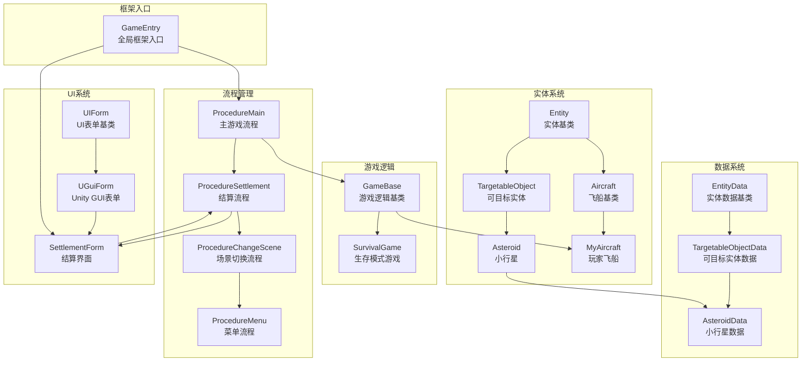
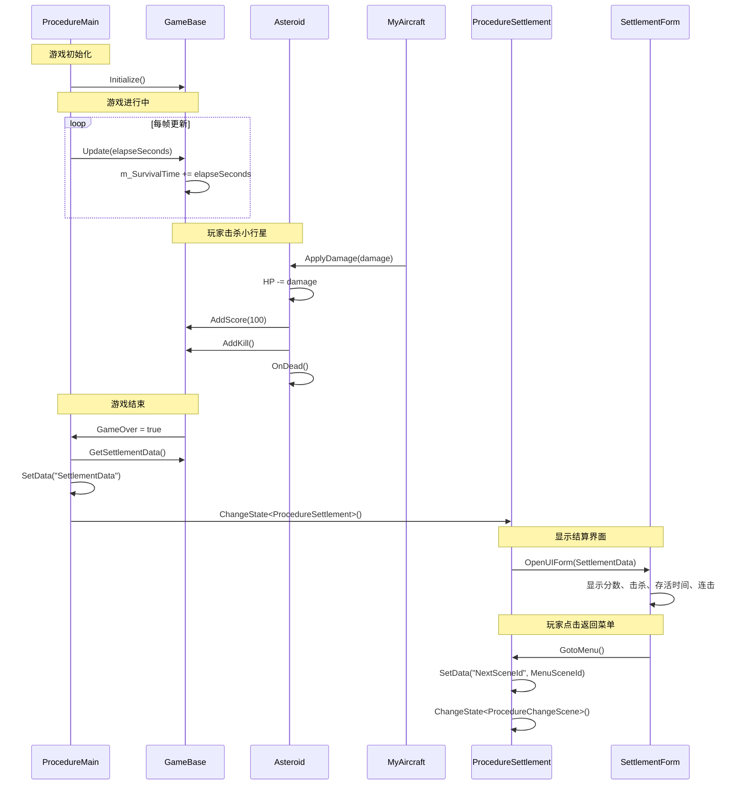

# 14个脚本关联关系详细分析

## 文档说明

本文档详细分析了当前 VSCode 打开的 14 个脚本之间的关联关系，包括流程管理、游戏逻辑、实体系统、数据系统和 UI 系统的完整交互链。

---

## 1. 脚本列表

| 序号 | 文件名 | 路径 | 类型 |
|------|--------|------|------|
| 1 | GameBase.cs | `Assets/GameMain/Scripts/Game/GameBase.cs` | 游戏逻辑基类 |
| 2 | ProcedureMain.cs | `Assets/GameMain/Scripts/Procedure/ProcedureMain.cs` | 主游戏流程 |
| 3 | ProcedureSettlement.cs | `Assets/GameMain/Scripts/Procedure/ProcedureSettlement.cs` | 结算流程 |
| 4 | SettlementForm.cs | `Assets/GameMain/Scripts/UI/SettlementForm.cs` | 结算界面 |
| 5 | UGuiForm.cs | `Assets/GameMain/Scripts/UI/UGuiForm.cs` | Unity GUI 表单基类 |
| 6 | GameEntry.cs | `Assets/GameMain/Scripts/Base/GameEntry.cs` | 框架入口 |
| 7 | UIForm.cs | `Assets/GameFramework/Scripts/Runtime/UI/UIForm.cs` | UI 表单基类 |
| 8 | OpenUIFormSuccessEventArgs.cs | `Assets/GameFramework/Scripts/Runtime/UI/OpenUIFormSuccessEventArgs.cs` | UI 打开成功事件 |
| 9 | VarObject.cs | `Assets/GameFramework/Scripts/Runtime/Variable/VarObject.cs` | 变量包装类 |
| 10 | AsteroidData.cs | `Assets/GameMain/Scripts/Entity/EntityData/AsteroidData.cs` | 小行星数据 |
| 11 | MyAircraft.cs | `Assets/GameMain/Scripts/Entity/EntityLogic/MyAircraft.cs` | 玩家飞船 |
| 12 | TargetableObject.cs | `Assets/GameMain/Scripts/Entity/EntityLogic/TargetableObject.cs` | 可目标实体 |
| 13 | Asteroid.cs | `Assets/GameMain/Scripts/Entity/EntityLogic/Asteroid.cs` | 小行星实体 |
| 14 | 项目总结文档 | `docs/project-summary-and-learning-points.md` | 项目文档 |

---

## 2. 整体架构图



---

## 3. 详细关联说明

### 3.1 流程管理关联

#### 3.1.1 ProcedureMain → GameBase

**关联代码位置：**
- 调用方：[`ProcedureMain.cs:68-69`](Assets/GameMain/Scripts/Procedure/ProcedureMain.cs:68)
- 被调用方：[`GameBase.cs:103`](Assets/GameMain/Scripts/Game/GameBase.cs:103)

**关联内容：**
```csharp
// ProcedureMain.OnEnter 中
m_CurrentGame = m_Games[gameMode];
m_CurrentGame.Initialize();  // 初始化游戏

// ProcedureMain.OnUpdate 中
m_CurrentGame.Update(elapseSeconds, realElapseSeconds);  // 每帧更新游戏
```

**作用：**
- `ProcedureMain` 作为流程管理器，负责创建和管理 `GameBase` 实例
- 根据游戏模式（GameMode）选择对应的游戏实例（如 `SurvivalGame`）
- 在流程进入时初始化游戏，在每帧更新游戏逻辑

#### 3.1.2 ProcedureMain → ProcedureSettlement

**关联代码位置：**
- 调用方：[`ProcedureMain.cs:115`](Assets/GameMain/Scripts/Procedure/ProcedureMain.cs:115)

**关联内容：**
```csharp
// 游戏结束时，切换到结算流程
GameSettlementData settlementData = m_CurrentGame.GetSettlementData();
VarObject varObject = ReferencePool.Acquire<VarObject>();
varObject.Value = settlementData;
procedureOwner.SetData<VarObject>("SettlementData", varObject);
ChangeState<ProcedureSettlement>(procedureOwner);
```

**作用：**
- 游戏结束后，从 `GameBase` 获取结算数据
- 通过 FSM 的 `SetData` 方法传递结算数据
- 切换到 `ProcedureSettlement` 流程

#### 3.1.3 ProcedureSettlement → SettlementForm

**关联代码位置：**
- 调用方：[`ProcedureSettlement.cs:68`](Assets/GameMain/Scripts/Procedure/ProcedureSettlement.cs:68)
- 被调用方：[`SettlementForm.cs:48-87`](Assets/GameMain/Scripts/UI/SettlementForm.cs:48)

**关联内容：**
```csharp
// ProcedureSettlement.OnEnter 中
GameEntry.UI.OpenUIForm(UIFormId.SettlementForm, settlementData);

// SettlementForm.OnOpen 中
GameSettlementData settlementData = (GameSettlementData)userData;
m_ScoreText.text = Utility.Text.Format("得分: {0}", settlementData.Score);
m_KillCountText.text = Utility.Text.Format("击杀: {0}", settlementData.KillCount);
m_SurvivalTimeText.text = Utility.Text.Format("存活时间: {0:F1}秒", settlementData.SurvivalTime);
m_MaxComboText.text = Utility.Text.Format("最大连击: {0}", settlementData.MaxCombo);
```

**作用：**
- `ProcedureSettlement` 负责打开结算界面
- 传递 `GameSettlementData` 给 `SettlementForm`
- `SettlementForm` 接收数据并显示给玩家

#### 3.1.4 SettlementForm → ProcedureSettlement

**关联代码位置：**
- 调用方：[`SettlementForm.cs:103`](Assets/GameMain/Scripts/UI/SettlementForm.cs:103)
- 被调用方：[`ProcedureSettlement.cs:33`](Assets/GameMain/Scripts/Procedure/ProcedureSettlement.cs:33)

**关联内容：**
```csharp
// SettlementForm.OnBackToMenuButtonClick 中
private void OnBackToMenuButtonClick()
{
    if (m_ProcedureSettlement != null)
    {
        m_ProcedureSettlement.GotoMenu();  // 调用流程的返回菜单方法
    }
}

// ProcedureSettlement.GotoMenu 中
public void GotoMenu()
{
    m_GotoMenu = true;  // 设置标志位
}

// ProcedureSettlement.OnUpdate 中检测标志
if (m_GotoMenu)
{
    procedureOwner.SetData<VarInt32>("NextSceneId", GameEntry.Config.GetInt("Scene.Menu"));
    ChangeState<ProcedureChangeScene>(procedureOwner);
}
```

**作用：**
- 玩家点击返回菜单按钮时，通知流程切换
- `ProcedureSettlement` 检测到标志后，切换到菜单场景

---

### 3.2 游戏逻辑关联

#### 3.2.1 GameBase 核心功能

**关联代码位置：** [`GameBase.cs:103-115`](Assets/GameMain/Scripts/Game/GameBase.cs:103)

**核心属性：**
```csharp
private int m_Score = 0;           // 分数
private int m_KillCount = 0;        // 击杀数
private float m_SurvivalTime = 0f;   // 存活时间
private int m_CurrentCombo = 0;       // 当前连击
private int m_MaxCombo = 0;          // 最大连击
public bool GameOver { get; protected set; }  // 游戏结束标志
```

**核心方法：**
```csharp
// 累计存活时间
public virtual void Update(float elapseSeconds, float realElapseSeconds)
{
    if (!GameOver)
    {
        m_SurvivalTime += elapseSeconds;  // 每帧增加存活时间
    }
}

// 增加分数
public void AddScore(int score)
{
    m_Score += score;
}

// 增加击杀数
public void AddKill()
{
    m_KillCount++;
    m_CurrentCombo++;
    if (m_CurrentCombo > m_MaxCombo)
    {
        m_MaxCombo = m_CurrentCombo;
    }
}

// 重置连击
public void ResetCombo()
{
    m_CurrentCombo = 0;
}

// 获取结算数据
public GameSettlementData GetSettlementData()
{
    return new GameSettlementData(m_Score, m_KillCount, m_SurvivalTime, m_MaxCombo);
}
```

**作用：**
- 管理游戏的核心数据：分数、击杀数、存活时间、连击
- 提供数据累加和重置方法
- 生成结算数据供流程使用

---

### 3.3 实体系统关联

#### 3.3.1 Entity → TargetableObject

**继承关系：**
```
Entity (GameFramework)
  └─> TargetableObject (自定义)
```

**作用：**
- `Entity` 是 GameFramework 提供的实体基类
- `TargetableObject` 继承 `Entity`，添加可被攻击的特性

#### 3.3.2 TargetableObject → Asteroid

**继承关系：**
```
TargetableObject
  └─> Asteroid (小行星)
```

**作用：**
- `TargetableObject` 提供可被目标的通用功能（HP、伤害、死亡）
- `Asteroid` 继承并实现小行星的具体行为

#### 3.3.3 TargetableObject 核心功能

**关联代码位置：** [`TargetableObject.cs:31-45`](Assets/GameMain/Scripts/Entity/EntityLogic/TargetableObject.cs:31)

**核心方法：**
```csharp
// 应用伤害
public void ApplyDamage(Entity attacker, int damageHP)
{
    float fromHPRatio = m_TargetableObjectData.HPRatio;
    m_TargetableObjectData.HP -= damageHP;
    float toHPRatio = m_TargetableObjectData.HPRatio;
    
    // 显示 HP 条
    if (fromHPRatio > toHPRatio)
    {
        GameEntry.HPBar.ShowHPBar(this, fromHPRatio, toHPRatio);
    }
    
    // HP 耗尽时死亡
    if (m_TargetableObjectData.HP <= 0)
    {
        OnDead(attacker);
    }
}

// 死亡处理
protected virtual void OnDead(Entity attacker)
{
    GameEntry.Entity.HideEntity(this);
}

// 碰撞检测
private void OnTriggerEnter(Collider other)
{
    Entity entity = other.gameObject.GetComponent<Entity>();
    if (entity == null) return;
    
    if (entity is TargetableObject && entity.Id >= Id)
    {
        return;  // 由 ID 小的一方处理，避免重复
    }
    
    AIUtility.PerformCollision(this, entity);
}
```

**作用：**
- 处理伤害计算和 HP 管理
- 显示 HP 条
- 处理死亡逻辑
- 处理碰撞检测

#### 3.3.4 Asteroid 具体实现

**关联代码位置：** [`Asteroid.cs:42-67`](Assets/GameMain/Scripts/Entity/EntityLogic/Asteroid.cs:42)

**核心功能：**
```csharp
// 移动
protected override void OnUpdate(float elapseSeconds, float realElapseSeconds)
{
    CachedTransform.Translate(Vector3.back * m_AsteroidData.Speed * elapseSeconds, Space.World);
    CachedTransform.Rotate(m_RotateSphere * m_AsteroidData.AngularSpeed * elapseSeconds, Space.Self);
}

// 死亡时记录数据
protected override void OnDead(Entity attacker)
{
    base.OnDead(attacker);
    
    // 获取当前游戏实例并更新数据
    GameBase currentGame = ProcedureMain.CurrentGame;
    if (currentGame != null)
    {
        currentGame.AddScore(100);  // 击杀小行星加 100 分
        currentGame.AddKill();      // 增加击杀数
    }
    
    // 播放死亡特效和音效
    GameEntry.Entity.ShowEffect(new EffectData(...));
    GameEntry.Sound.PlaySound(m_AsteroidData.DeadSoundId);
}

// 获取碰撞数据
public override ImpactData GetImpactData()
{
    return new ImpactData(m_AsteroidData.Camp, m_AsteroidData.HP, m_AsteroidData.Attack, 0);
}
```

**作用：**
- 实现小行星的移动和旋转
- 死亡时调用 `GameBase` 更新分数和击杀数
- 播放死亡特效和音效

#### 3.3.5 MyAircraft 具体实现

**关联代码位置：** [`MyAircraft.cs:83-93`](Assets/GameMain/Scripts/Entity/EntityLogic/MyAircraft.cs:83)

**核心功能：**
```csharp
// 重写 ApplyDamage 以重置连击
public new void ApplyDamage(Entity attacker, int damageHP)
{
    base.ApplyDamage(attacker, damageHP);
    
    // 玩家受伤时重置连击
    GameBase currentGame = ProcedureMain.CurrentGame;
    if (currentGame != null)
    {
        currentGame.ResetCombo();
    }
}

// 鼠标控制移动
protected override void OnUpdate(float elapseSeconds, float realElapseSeconds)
{
    if (Input.GetMouseButton(0))
    {
        Vector3 point = Camera.main.ScreenToWorldPoint(Input.mousePosition);
        m_TargetPosition = new Vector3(point.x, 0f, point.z);
        
        // 发射武器
        for (int i = 0; i < m_Weapons.Count; i++)
        {
            m_Weapons[i].TryAttack();
        }
    }
    
    // 移动飞船
    Vector3 direction = m_TargetPosition - CachedTransform.localPosition;
    Vector3 speed = Vector3.ClampMagnitude(direction.normalized * m_MyAircraftData.Speed * elapseSeconds, direction.magnitude);
    CachedTransform.localPosition = new Vector3(
        Mathf.Clamp(CachedTransform.localPosition.x + speed.x, m_PlayerMoveBoundary.xMin, m_PlayerMoveBoundary.xMax),
        0f,
        Mathf.Clamp(CachedTransform.localPosition.z + speed.z, m_PlayerMoveBoundary.yMin, m_PlayerMoveBoundary.yMax)
    );
}
```

**作用：**
- 实现玩家飞船的鼠标控制
- 武器发射
- 受伤时重置连击

---

### 3.4 数据系统关联

#### 3.4.1 EntityData → TargetableObjectData

**继承关系：**
```
EntityData
  └─> TargetableObjectData
```

**作用：**
- `EntityData` 定义实体的基础属性（ID、类型、阵营）
- `TargetableObjectData` 添加可目标实体的属性（HP、HP 比例）

#### 3.4.2 TargetableObjectData → AsteroidData

**继承关系：**
```
TargetableObjectData
  └─> AsteroidData
```

**关联代码位置：** [`AsteroidData.cs:35-50`](Assets/GameMain/Scripts/Entity/EntityData/AsteroidData.cs:35)

**核心属性：**
```csharp
public AsteroidData(int entityId, int typeId) : base(entityId, typeId, CampType.Neutral)
{
    IDataTable<DRAsteroid> dtAsteroid = GameEntry.DataTable.GetDataTable<DRAsteroid>();
    DRAsteroid drAsteroid = dtAsteroid.GetDataRow(TypeId);
    
    HP = m_MaxHP = drAsteroid.MaxHP;
    m_Attack = drAsteroid.Attack;
    m_Speed = drAsteroid.Speed;
    m_AngularSpeed = drAsteroid.AngularSpeed;
    m_DeadEffectId = drAsteroid.DeadEffectId;
    m_DeadSoundId = drAsteroid.DeadSoundId;
}

public int Attack { get { return m_Attack; }      // 攻击力
public float Speed { get { return m_Speed; }      // 移动速度
public float AngularSpeed { get { return m_AngularSpeed; }  // 旋转速度
public int DeadEffectId { get { return m_DeadEffectId; }  // 死亡特效 ID
public int DeadSoundId { get { return m_DeadSoundId; }    // 死亡音效 ID
```

**作用：**
- 从数据表读取小行星的配置
- 提供小行星的所有属性给实体使用

---

### 3.5 UI 系统关联

#### 3.5.1 UIForm → UGuiForm

**继承关系：**
```
UIForm (GameFramework)
  └─> UGuiForm
```

**作用：**
- `UIForm` 是 GameFramework 提供的 UI 表单抽象类
- `UGuiForm` 继承并封装 Unity UI 的生命周期

#### 3.5.2 UGuiForm → SettlementForm

**继承关系：**
```
UGuiForm
  └─> SettlementForm
```

**关联代码位置：** [`SettlementForm.cs:18-106`](Assets/GameMain/Scripts/UI/SettlementForm.cs:18)

**核心功能：**
```csharp
public class SettlementForm : UGuiForm
{
    [SerializeField] private Text m_ScoreText = null;
    [SerializeField] private Text m_KillCountText = null;
    [SerializeField] private Text m_SurvivalTimeText = null;
    [SerializeField] private Text m_MaxComboText = null;
    [SerializeField] private Button m_BackToMenuButton = null;
    
    private ProcedureSettlement m_ProcedureSettlement = null;
    
    // 打开时显示数据
    protected override void OnOpen(object userData)
    {
        GameSettlementData settlementData = (GameSettlementData)userData;
        m_ScoreText.text = Utility.Text.Format("得分: {0}", settlementData.Score);
        m_KillCountText.text = Utility.Text.Format("击杀: {0}", settlementData.KillCount);
        m_SurvivalTimeText.text = Utility.Text.Format("存活时间: {0:F1}秒", settlementData.SurvivalTime);
        m_MaxComboText.text = Utility.Text.Format("最大连击: {0}", settlementData.MaxCombo);
    }
    
    // 按钮点击事件
    private void OnBackToMenuButtonClick()
    {
        if (m_ProcedureSettlement != null)
        {
            m_ProcedureSettlement.GotoMenu();
        }
    }
}
```

**作用：**
- 显示结算数据（分数、击杀、存活时间、连击）
- 提供返回菜单按钮
- 与流程系统交互

---

### 3.6 框架入口关联

#### 3.6.1 GameEntry 全局访问

**关联代码位置：** [`GameEntry.cs`](Assets/GameMain/Scripts/Base/GameEntry.cs)

**核心功能：**
```csharp
public static class GameEntry
{
    public static ProcedureComponent Procedure { get; }      // 流程管理器
    public static EntityComponent Entity { get; }          // 实体管理器
    public static UIComponent UI { get; }                // UI 管理器
    public static DataTableComponent DataTable { get; }      // 数据表管理器
    public static SoundComponent Sound { get; }          // 声音管理器
    public static ConfigComponent Config { get; }          // 配置管理器
    public static HPBarComponent HPBar { get; }           // HP 条管理器
}
```

**作用：**
- 提供全局静态访问所有框架模块
- 简化模块调用，无需传递引用

---

## 4. 完整数据流



---

## 5. 继承层次总结

```
GameFramework 框架层
├─> ProcedureBase
│   └─> ProcedureMain
│   └─> ProcedureSettlement
│
├─> Entity
│   └─> TargetableObject
│       └─> Asteroid
│
└─> UIForm
    └─> UGuiForm
        └─> SettlementForm

自定义游戏层
├─> GameBase
│   └─> SurvivalGame
│
└─> Aircraft
    └─> MyAircraft

数据层
├─> EntityData
│   └─> TargetableObjectData
│       └─> AsteroidData
│
└─> DRAsteroid (数据表行)

框架入口
└─> GameEntry
```

---

## 6. 关键设计模式

### 6.1 状态机模式（FSM）

**实现位置：** 流程管理（ProcedureMain, ProcedureSettlement）

**说明：**
- 游戏流程使用有限状态机管理
- 每个流程是一个状态（Procedure）
- 通过 `ChangeState<T>()` 切换状态
- 状态切换时自动调用 `OnLeave` 和 `OnEnter`

### 6.2 观察者模式

**实现位置：** 事件系统（OpenUIFormSuccessEventArgs）

**说明：**
- UI 打开成功时触发事件
- 流程订阅事件获取 UI 引用
- 解耦 UI 和流程的依赖关系

### 6.3 模板方法模式

**实现位置：** GameBase, Entity, UIForm

**说明：**
- 基类定义生命周期方法（OnInit, OnEnter, OnUpdate, OnLeave）
- 子类重写具体行为
- 框架在适当时机调用这些方法

### 6.4 单例模式

**实现位置：** GameEntry

**说明：**
- `GameEntry` 提供全局静态访问
- 所有模块通过静态属性访问
- 简化模块间的调用

---

## 7. 数据传递机制

### 7.1 FSM 数据传递

**流程间数据传递：**
```csharp
// ProcedureMain → ProcedureSettlement
procedureOwner.SetData<VarObject>("SettlementData", varObject);

// ProcedureSettlement 读取数据
VarObject varObject = procedureOwner.GetData<VarObject>("SettlementData");
GameSettlementData settlementData = (GameSettlementData)varObject.Value;
```

### 7.2 UI 数据传递

**流程 → UI 数据传递：**
```csharp
// ProcedureSettlement → SettlementForm
GameEntry.UI.OpenUIForm(UIFormId.SettlementForm, settlementData);

// SettlementForm 接收数据
protected override void OnOpen(object userData)
{
    GameSettlementData settlementData = (GameSettlementData)userData;
}
```

### 7.3 实体数据传递

**数据表 → 实体数据传递：**
```csharp
// AsteroidData 构造时从数据表读取
IDataTable<DRAsteroid> dtAsteroid = GameEntry.DataTable.GetDataTable<DRAsteroid>();
DRAsteroid drAsteroid = dtAsteroid.GetDataRow(TypeId);
HP = drAsteroid.MaxHP;
```

---

## 8. 总结

这 14 个脚本共同构成了一个完整的**游戏开发框架**，涵盖了：

1. **流程管理**：控制游戏的整体流程（菜单、游戏、结算）
2. **游戏逻辑**：管理游戏数据和规则
3. **实体系统**：处理游戏对象的创建、更新、销毁
4. **数据系统**：从配置表读取实体属性
5. **UI 系统**：显示游戏信息和接收用户输入
6. **框架入口**：提供统一的模块访问接口

整个系统通过**事件驱动**和**状态机**模式实现了各模块之间的松耦合，便于维护和扩展。

---

**文档生成时间：** 2025-12-25  
**项目名称：** StarForce (GameFramework 示例项目)
**分析脚本数量：** 14 个
