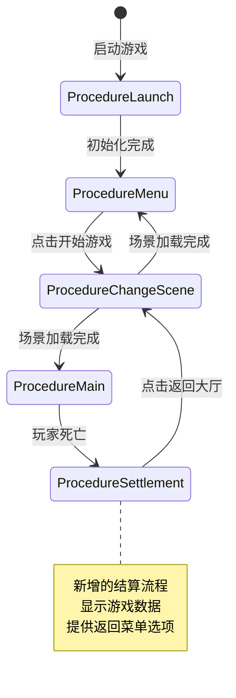
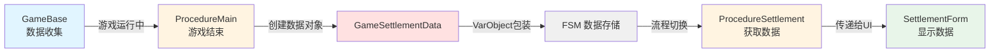
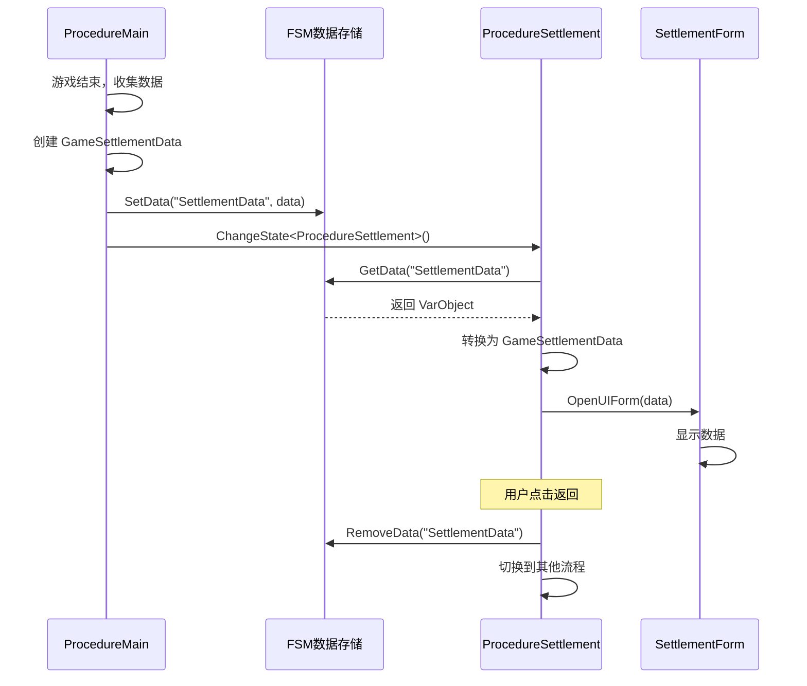
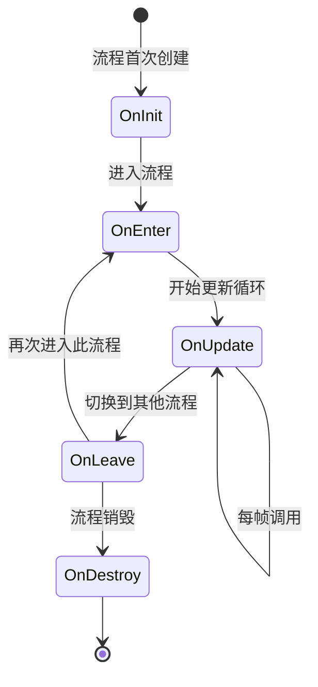
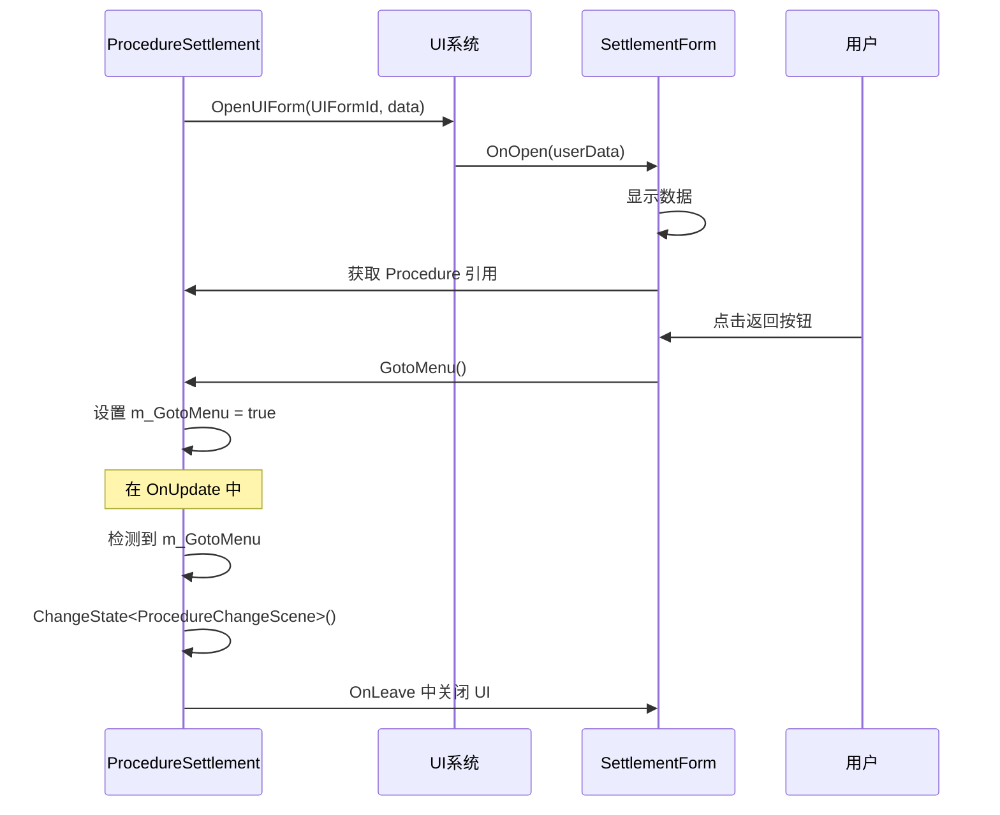
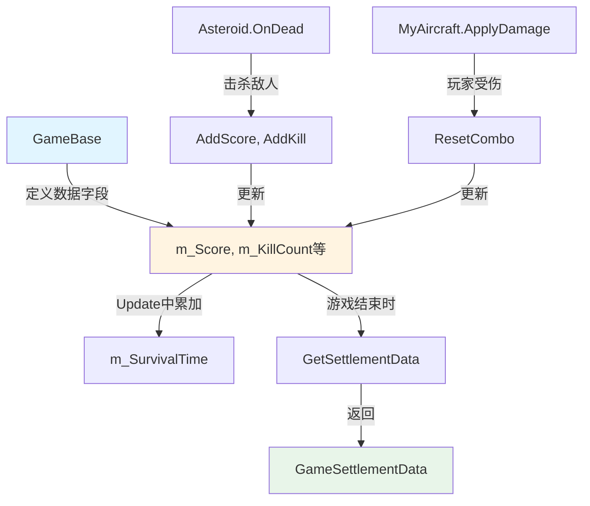

# StarForce 游戏结算系统 - 项目总结与学习要点

## 📋 文档概述

本文档是一份教学导向的项目总结，详细记录了在 StarForce 项目中实现游戏结算系统的完整过程。通过本文档，您将深入理解 GameFramework 的核心概念，掌握跨流程数据传递、流程生命周期管理等关键技术。

---

## 1. 项目概述

### 1.1 项目目标

为 StarForce 游戏添加一个完整的结算流程系统，实现以下功能：

- ✅ 游戏结束后自动进入结算界面
- ✅ 显示游戏统计数据（得分、击杀数、存活时间、最大连击）
- ✅ 提供返回主菜单功能
- ✅ 保持良好的代码架构和可扩展性

### 1.2 项目成果

#### 新增文件

| 文件路径 | 说明 |
|---------|------|
| [`Assets/GameMain/Scripts/Definition/DataStruct/GameSettlementData.cs`](../Assets/GameMain/Scripts/Definition/DataStruct/GameSettlementData.cs) | 游戏结算数据结构定义 |
| [`Assets/GameMain/Scripts/Procedure/ProcedureSettlement.cs`](../Assets/GameMain/Scripts/Procedure/ProcedureSettlement.cs) | 结算流程类 |
| [`Assets/GameMain/Scripts/UI/SettlementForm.cs`](../Assets/GameMain/Scripts/UI/SettlementForm.cs) | 结算界面UI类 |
| [`plans/settlement-architecture-design.md`](../plans/settlement-architecture-design.md) | 架构设计文档 |
| [`docs/unity-editor-configuration-guide.md`](../docs/unity-editor-configuration-guide.md) | Unity 编辑器配置指南 |

#### 修改文件

| 文件路径 | 修改内容 |
|---------|---------|
| [`Assets/GameMain/Scripts/Game/GameBase.cs`](../Assets/GameMain/Scripts/Game/GameBase.cs) | 添加数据收集字段和方法 |
| [`Assets/GameMain/Scripts/Procedure/ProcedureMain.cs`](../Assets/GameMain/Scripts/Procedure/ProcedureMain.cs) | 修改游戏结束逻辑，切换到结算流程 |
| [`Assets/GameMain/Scripts/Entity/EntityLogic/Asteroid.cs`](../Assets/GameMain/Scripts/Entity/EntityLogic/Asteroid.cs) | 添加击杀数据记录 |
| [`Assets/GameMain/Scripts/Entity/EntityLogic/MyAircraft.cs`](../Assets/GameMain/Scripts/Entity/EntityLogic/MyAircraft.cs) | 添加连击重置逻辑 |
| [`Assets/GameMain/Scripts/UI/UIFormId.cs`](../Assets/GameMain/Scripts/UI/UIFormId.cs) | 添加 SettlementForm 枚举 |

### 1.3 流程状态图



---

## 2. 实现过程回顾

### 阶段1：项目分析（理解现有架构）

#### 分析的核心概念

**1. GameFramework 的流程系统（Procedure）**
- 流程是游戏状态的抽象，每个流程代表游戏的一个阶段
- 流程之间通过有限状态机（FSM）进行切换
- 每个流程都有完整的生命周期：初始化 → 进入 → 更新 → 离开

**2. 现有流程分析**
- [`ProcedureLaunch`](../Assets/GameMain/Scripts/Procedure/ProcedureLaunch.cs): 游戏启动流程
- `ProcedureMenu`: 主菜单流程
- `ProcedureChangeScene`: 场景切换流程
- [`ProcedureMain`](../Assets/GameMain/Scripts/Procedure/ProcedureMain.cs:15): 游戏主流程

**3. 发现的问题**
- 游戏结束后直接返回菜单，没有结算环节
- 游戏数据（分数、击杀数等）没有被收集和展示
- 缺少玩家反馈和成就感

### 阶段2：架构设计（为什么选择独立流程）

#### 设计决策：结算作为独立流程

**理由1：单一职责原则**
- [`ProcedureMain`](../Assets/GameMain/Scripts/Procedure/ProcedureMain.cs:15) 专注于游戏逻辑运行
- `ProcedureSettlement` 专注于结算数据展示
- 职责清晰，互不干扰

**理由2：生命周期管理**
- 游戏结束需要清理游戏实体和资源
- 结算界面需要独立的生命周期管理UI
- 独立流程可以更好地控制资源加载和卸载

**理由3：状态隔离**
- 游戏运行状态和结算展示状态完全分离
- 避免在游戏逻辑中混入UI展示代码
- 便于后续扩展（动画、特效、排行榜等）

**理由4：符合 GameFramework 设计模式**
- 遵循框架的 FSM 设计理念
- 流程切换逻辑明确，易于理解和维护
- 便于调试和测试

#### 数据流设计



### 阶段3：代码实现（分步骤详解）

详细的实现步骤和代码示例请参考：[`架构设计文档`](../plans/settlement-architecture-design.md)

**关键实现点**：
1. 定义 [`GameSettlementData`](../Assets/GameMain/Scripts/Definition/DataStruct/GameSettlementData.cs) 数据结构
2. 在 [`GameBase.cs`](../Assets/GameMain/Scripts/Game/GameBase.cs:36-152) 中添加数据收集逻辑
3. 在 [`Asteroid.cs`](../Assets/GameMain/Scripts/Entity/EntityLogic/Asteroid.cs:66-72) 和 [`MyAircraft.cs`](../Assets/GameMain/Scripts/Entity/EntityLogic/MyAircraft.cs:93-103) 中记录游戏数据
4. 修改 [`ProcedureMain.cs`](../Assets/GameMain/Scripts/Procedure/ProcedureMain.cs:113-115) 切换到结算流程
5. 创建 [`ProcedureSettlement.cs`](../Assets/GameMain/Scripts/Procedure/ProcedureSettlement.cs) 流程类
6. 创建 [`SettlementForm.cs`](../Assets/GameMain/Scripts/UI/SettlementForm.cs) UI类

### 阶段4：配置和测试

详细的配置步骤请参考：[`Unity 编辑器配置指南`](../docs/unity-editor-configuration-guide.md)

**配置清单**：
- ✅ 添加 ProcedureSettlement 到 ProcedureComponent
- ✅ 配置 UIForm 数据表
- ✅ 创建 UI 预制体
- ✅ 绑定 UI 组件
- ✅ 测试完整流程

---

## 3. 核心学习要点

### 学习要点1：跨流程传参 ⭐⭐⭐

#### 概念解释

**什么是跨流程传参？**

在 GameFramework 中，不同的流程（Procedure）之间需要传递数据时，不能直接通过构造函数或方法参数传递，因为流程的创建和切换由框架的 FSM（有限状态机）管理。跨流程传参就是通过 FSM 的数据存储机制，在流程之间安全地传递数据。

**为什么需要跨流程传参？**

1. **流程隔离**：每个流程是独立的状态，不能直接访问其他流程的私有数据
2. **生命周期管理**：流程可能被创建、销毁，数据需要在流程切换时保持
3. **解耦设计**：避免流程之间的直接依赖，保持代码的可维护性

#### 实现方式

**1. 设置数据（在源流程中）**

在 [`ProcedureMain.cs:113-115`](../Assets/GameMain/Scripts/Procedure/ProcedureMain.cs:113)：

```csharp
// 创建数据对象
GameSettlementData settlementData = m_CurrentGame.GetSettlementData();

// 使用 VarObject 包装数据
procedureOwner.SetData<VarObject>("SettlementData", settlementData);

// 切换到目标流程
ChangeState<ProcedureSettlement>(procedureOwner);
```

**2. 获取数据（在目标流程中）**

在 [`ProcedureSettlement.cs:53-65`](../Assets/GameMain/Scripts/Procedure/ProcedureSettlement.cs:53)：

```csharp
// 从 FSM 获取数据
VarObject varObject = procedureOwner.GetData<VarObject>("SettlementData");

// 检查数据有效性
if (varObject == null || varObject.Value == null)
{
    Log.Warning("Settlement data is invalid, using default values.");
    settlementData = new GameSettlementData(0, 0, 0f, 0);
}
else
{
    // 转换为实际类型
    settlementData = (GameSettlementData)varObject.Value;
}
```

**3. 清理数据（在离开流程时）**

在 [`ProcedureSettlement.cs:99-102`](../Assets/GameMain/Scripts/Procedure/ProcedureSettlement.cs:99)：

```csharp
// 清理 FSM 中的数据，避免内存泄漏
if (procedureOwner.HasData("SettlementData"))
{
    procedureOwner.RemoveData("SettlementData");
}
```

#### 为什么使用 VarObject？

**VarObject 的作用**：
- GameFramework 的变量系统基类，可以包装任意类型的对象
- 提供统一的接口用于 FSM 数据存储
- 支持引用类型和值类型

**使用示例对比**：

```csharp
// ❌ 错误：不能直接存储自定义类型
procedureOwner.SetData<GameSettlementData>("SettlementData", settlementData);

// ✅ 正确：使用 VarObject 包装
procedureOwner.SetData<VarObject>("SettlementData", settlementData);
```

#### 数据传递流程图



#### 最佳实践

**1. 数据生命周期管理**

```csharp
// ✅ 好的做法：在 OnLeave 中清理数据
protected override void OnLeave(ProcedureOwner procedureOwner, bool isShutdown)
{
    if (procedureOwner.HasData("SettlementData"))
    {
        procedureOwner.RemoveData("SettlementData");
    }
    base.OnLeave(procedureOwner, isShutdown);
}
```

**2. 数据有效性检查**

```csharp
// ✅ 好的做法：检查数据有效性
VarObject varObject = procedureOwner.GetData<VarObject>("SettlementData");
if (varObject == null || varObject.Value == null)
{
    Log.Warning("Data is invalid");
    // 使用默认值
    return;
}
```

**3. 数据键名管理**

```csharp
// ✅ 好的做法：使用常量管理键名
public static class ProcedureDataKeys
{
    public const string SettlementData = "SettlementData";
    public const string NextSceneId = "NextSceneId";
}
```

---

### 学习要点2：流程生命周期管理 ⭐⭐⭐

#### 概念解释

**什么是流程生命周期？**

在 GameFramework 中，每个 Procedure（流程）都有完整的生命周期，类似于 Unity 的 MonoBehaviour，但更加明确和可控。理解生命周期是正确使用流程系统的关键。

#### 生命周期方法详解



**1. OnInit() - 初始化**

```csharp
protected override void OnInit(ProcedureOwner procedureOwner)
{
    base.OnInit(procedureOwner);
    // 一次性初始化工作
}
```

- **调用时机**：流程第一次被创建时，整个游戏运行期间只调用一次
- **用途**：初始化不会改变的数据、创建需要复用的对象

**2. OnEnter() - 进入流程**

在 [`ProcedureSettlement.cs:43-69`](../Assets/GameMain/Scripts/Procedure/ProcedureSettlement.cs:43)：

```csharp
protected override void OnEnter(ProcedureOwner procedureOwner)
{
    base.OnEnter(procedureOwner);

    // 1. 订阅事件
    GameEntry.Event.Subscribe(OpenUIFormSuccessEventArgs.EventId, OnOpenUIFormSuccess);

    // 2. 重置状态
    m_GotoMenu = false;

    // 3. 获取数据
    VarObject varObject = procedureOwner.GetData<VarObject>("SettlementData");
    
    // 4. 打开UI
    GameEntry.UI.OpenUIForm(UIFormId.SettlementForm, settlementData);
}
```

- **调用时机**：每次进入此流程时调用，可能被多次调用
- **用途**：订阅事件、获取流程数据、打开UI界面、初始化流程状态

**3. OnUpdate() - 每帧更新**

在 [`ProcedureSettlement.cs:71-84`](../Assets/GameMain/Scripts/Procedure/ProcedureSettlement.cs:71)：

```csharp
protected override void OnUpdate(ProcedureOwner procedureOwner, float elapseSeconds, float realElapseSeconds)
{
    base.OnUpdate(procedureOwner, elapseSeconds, realElapseSeconds);

    // 监听状态变化
    if (m_GotoMenu)
    {
        procedureOwner.SetData<VarInt32>("NextSceneId", GameEntry.Config.GetInt("Scene.Menu"));
        ChangeState<ProcedureChangeScene>(procedureOwner);
    }
}
```

- **调用时机**：流程激活期间每帧调用
- **用途**：监听状态变化、处理输入、更新逻辑、检查流程切换条件

**4. OnLeave() - 离开流程**

在 [`ProcedureSettlement.cs:86-105`](../Assets/GameMain/Scripts/Procedure/ProcedureSettlement.cs:86)：

```csharp
protected override void OnLeave(ProcedureOwner procedureOwner, bool isShutdown)
{
    // 1. 取消订阅事件
    GameEntry.Event.Unsubscribe(OpenUIFormSuccessEventArgs.EventId, OnOpenUIFormSuccess);

    // 2. 关闭UI
    if (m_SettlementForm != null)
    {
        m_SettlementForm.Close(isShutdown);
        m_SettlementForm = null;
    }

    // 3. 清理数据
    if (procedureOwner.HasData("SettlementData"))
    {
        procedureOwner.RemoveData("SettlementData");
    }

    base.OnLeave(procedureOwner, isShutdown);
}
```

- **调用时机**：离开此流程时调用
- **用途**：取消订阅事件、关闭UI、清理数据、释放资源

#### 完整生命周期示例

参考 [`ProcedureSettlement.cs`](../Assets/GameMain/Scripts/Procedure/ProcedureSettlement.cs) 的完整实现。

#### 最佳实践

**1. 在哪个方法中做什么事情**

| 生命周期方法 | 适合做的事情 | 不适合做的事情 |
|------------|------------|--------------|
| OnInit | 创建对象池、加载配置 | 订阅事件、打开UI |
| OnEnter | 订阅事件、打开UI、获取数据 | 创建对象池 |
| OnUpdate | 监听状态、处理输入 | 订阅事件、打开UI |
| OnLeave | 取消订阅、关闭UI、清理数据 | 切换流程 |

**2. 事件订阅和取消订阅要成对**

```csharp
// ✅ 好的做法
protected override void OnEnter(ProcedureOwner procedureOwner)
{
    GameEntry.Event.Subscribe(EventId, OnEvent);
}

protected override void OnLeave(ProcedureOwner procedureOwner, bool isShutdown)
{
    GameEntry.Event.Unsubscribe(EventId, OnEvent);
}
```

**3. 避免在 OnUpdate 中做重复的初始化工作**

```csharp
// ❌ 坏的做法：每帧都检查和初始化
protected override void OnUpdate(ProcedureOwner procedureOwner, float elapseSeconds, float realElapseSeconds)
{
    if (m_SomeObject == null)
    {
        m_SomeObject = new SomeObject(); // 不应该在这里初始化
    }
}

// ✅ 好的做法：在 OnEnter 中初始化
protected override void OnEnter(ProcedureOwner procedureOwner)
{
    m_SomeObject = new SomeObject();
}
```

---

### 学习要点3：UI 与流程的交互 ⭐⭐⭐

#### 概念解释

**UI 如何与 Procedure 通信？**

在 GameFramework 中，UI 和 Procedure 是两个独立的系统，它们之间的通信需要遵循特定的模式，以保持解耦和可维护性。

#### 实现方式

**1. Procedure 打开 UI 并传递数据**

在 [`ProcedureSettlement.cs:68`](../Assets/GameMain/Scripts/Procedure/ProcedureSettlement.cs:68)：

```csharp
// Procedure 打开 UI，通过 userData 传递数据
GameEntry.UI.OpenUIForm(UIFormId.SettlementForm, settlementData);
```

**2. UI 接收数据**

在 [`SettlementForm.cs:52-95`](../Assets/GameMain/Scripts/UI/SettlementForm.cs:52)：

```csharp
protected override void OnOpen(object userData)
{
    base.OnOpen(userData);

    // 接收数据
    GameSettlementData settlementData = (GameSettlementData)userData;
    
    // 显示数据
    if (m_ScoreText != null)
    {
        m_ScoreText.text = Utility.Text.Format("得分: {0}", settlementData.Score);
    }
}
```

**3. UI 获取 Procedure 引用**

在 [`SettlementForm.cs:68`](../Assets/GameMain/Scripts/UI/SettlementForm.cs:68)：

```csharp
// 获取当前流程的引用
m_ProcedureSettlement = GameEntry.Procedure.CurrentProcedure as ProcedureSettlement;
```

**4. UI 调用 Procedure 方法**

在 [`SettlementForm.cs:110-116`](../Assets/GameMain/Scripts/UI/SettlementForm.cs:110)：

```csharp
private void OnBackToMenuButtonClick()
{
    if (m_ProcedureSettlement != null)
    {
        // UI 调用 Procedure 的公共方法
        m_ProcedureSettlement.GotoMenu();
    }
}
```

**5. Procedure 提供公共方法供 UI 调用**

在 [`ProcedureSettlement.cs:33-36`](../Assets/GameMain/Scripts/Procedure/ProcedureSettlement.cs:33)：

```csharp
public void GotoMenu()
{
    m_GotoMenu = true; // 设置标记，在 OnUpdate 中处理
}
```

#### 交互流程图



#### 最佳实践

**1. UI 和逻辑的解耦**

```csharp
// ✅ 好的做法：UI 只负责显示和用户交互
public class SettlementForm : UGuiForm
{
    private ProcedureSettlement m_Procedure;
    
    private void OnButtonClick()
    {
        // UI 不处理业务逻辑，只调用 Procedure 的方法
        m_Procedure?.GotoMenu();
    }
}

// ❌ 坏的做法：UI 中包含业务逻辑
public class SettlementForm : UGuiForm
{
    private void OnButtonClick()
    {
        // 不应该在 UI 中直接切换流程
        GameEntry.Procedure.ChangeState<ProcedureMenu>();
    }
}
```

**2. 数据传递的单向性**

```csharp
// ✅ 好的做法：数据从 Procedure 流向 UI
Procedure --> UI (通过 OnOpen 的 userData)
UI --> Procedure (通过调用公共方法，不传递复杂数据)

// ❌ 坏的做法：UI 向 Procedure 传递复杂数据
```

**3. 避免循环引用**

```csharp
// ✅ 好的做法：UI 持有 Procedure 的引用，但在 OnClose 中清理
protected override void OnClose(bool isShutdown, object userData)
{
    m_ProcedureSettlement = null; // 清理引用
    base.OnClose(isShutdown, userData);
}
```

---

### 学习要点4：数据收集模式 ⭐⭐

#### 概念解释

**如何在游戏运行过程中收集数据？**

游戏数据（如分数、击杀数）需要在游戏运行过程中持续收集，而不是在结算时才开始统计。这需要一个合理的数据收集架构。

#### 实现方式

**1. 在 GameBase 中定义数据字段**

在 [`GameBase.cs:36-72`](../Assets/GameMain/Scripts/Game/GameBase.cs:36)：

```csharp
// 游戏数据收集字段
private int m_Score = 0;
private int m_KillCount = 0;
private float m_SurvivalTime = 0f;
private int m_CurrentCombo = 0;
private int m_MaxCombo = 0;

// 提供公共属性访问
public int Score { get { return m_Score; } }
public int KillCount { get { return m_KillCount; } }
public float SurvivalTime { get { return m_SurvivalTime; } }
public int MaxCombo { get { return m_MaxCombo; } }
```

**2. 在游戏逻辑中更新数据**

在 [`GameBase.cs:103-116`](../Assets/GameMain/Scripts/Game/GameBase.cs:103)：

```csharp
public virtual void Update(float elapseSeconds, float realElapseSeconds)
{
    // 累加存活时间
    if (!GameOver)
    {
        m_SurvivalTime += elapseSeconds;
    }
}
```

**3. 在实体事件中记录数据**

在 [`Asteroid.cs:66-72`](../Assets/GameMain/Scripts/Entity/EntityLogic/Asteroid.cs:66)：

```csharp
protected override void OnDead(Entity attacker)
{
    base.OnDead(attacker);

    // 获取当前游戏实例
    GameBase currentGame = ProcedureMain.CurrentGame;
    if (currentGame != null)
    {
        currentGame.AddScore(100);  // 增加分数
        currentGame.AddKill();      // 增加击杀数
    }
}
```

在 [`MyAircraft.cs:93-103`](../Assets/GameMain/Scripts/Entity/EntityLogic/MyAircraft.cs:93)：

```csharp
public new void ApplyDamage(Entity attacker, int damageHP)
{
    base.ApplyDamage(attacker, damageHP);

    // 玩家受伤时重置连击
    GameBase currentGame = ProcedureMain.CurrentGame;
    if (currentGame != null)
    {
        currentGame.ResetCombo();
    }
}
```

**4. 提供数据获取方法**

在 [`GameBase.cs:150-153`](../Assets/GameMain/Scripts/Game/GameBase.cs:150)：

```csharp
public GameSettlementData GetSettlementData()
{
    return new GameSettlementData(m_Score, m_KillCount, m_SurvivalTime, m_MaxCombo);
}
```

#### 数据收集架构图



#### 最佳实践

**1. 数据的初始化和重置**

```csharp
// ✅ 好的做法：在 Initialize 中初始化数据
public virtual void Initialize()
{
    m_Score = 0;
    m_KillCount = 0;
    m_SurvivalTime = 0f;
    m_CurrentCombo = 0;
    m_MaxCombo = 0;
    GameOver = false;
}
```

**2. 通过静态引用访问游戏实例**

```csharp
// ✅ 好的做法：使用静态属性访问当前游戏实例
GameBase currentGame = ProcedureMain.CurrentGame;
if (currentGame != null)
{
    currentGame.AddScore(100);
}
```

**3. 数据收集的时机**

| 数据类型 | 收集时机 | 收集位置 |
|---------|---------|---------|
| 存活时间 | 每帧累加 | GameBase.Update() |
| 击杀数 | 敌人死亡时 | Asteroid.OnDead() |
| 分数 | 击杀敌人时 | Asteroid.OnDead() |
| 连击数 | 击杀时增加，受伤时重置 | AddKill() / ResetCombo() |

---

## 4. 架构设计思想

### 4.1 为什么结算适合作为独立流程

从软件工程的角度分析：

**1. 单一职责原则（SRP）**
- 每个流程只负责一个明确的功能
- ProcedureMain 负责游戏运行，ProcedureSettlement 负责结算展示
- 降低代码复杂度，提高可维护性

**2. 开闭原则（OCP）**
- 对扩展开放：可以轻松添加新的结算类型（胜利、失败、超时）
- 对修改关闭：添加结算功能不需要修改游戏主流程代码

**3. 依赖倒置原则（DIP）**
- 流程之间通过 FSM 接口通信，而不是直接依赖
- 降低耦合度，提高代码的灵活性

### 4.2 GameFramework 的设计模式

**1. 有限状态机（FSM）模式**
- 流程系统基于 FSM 实现
- 每个流程是一个状态，流程切换是状态转换
- 清晰的状态管理，避免状态混乱

**2. 组件化设计**
- GameEntry 提供统一的组件访问入口
- UI、Entity、Event 等都是独立的组件
- 高内聚低耦合

**3. 事件驱动架构**
- 使用事件系统解耦模块之间的通信
- 订阅-发布模式，灵活的消息传递

**4. 数据与表现分离**
- 数据（GameSettlementData）与UI（SettlementForm）分离
- 便于数据的复用和UI的替换

### 4.3 可维护性分析

**代码结构清晰**：
```
Procedure（流程层）
    ├── 负责流程控制和状态管理
    └── 不包含具体的业务逻辑

UI（表现层）
    ├── 负责数据展示和用户交互
    └── 不包含业务逻辑

Game（逻辑层）
    ├── 负责游戏逻辑和数据收集
    └── 不关心UI如何展示

Data（数据层）
    └── 纯数据结构，不包含逻辑
```

**易于定位问题**：
- 流程切换问题 → 检查 Procedure 类
- UI 显示问题 → 检查 UIForm 类
- 数据收集问题 → 检查 GameBase 和 Entity 类

### 4.4 可扩展性分析

**1. 添加新的结算数据**

只需修改三个地方：
1. GameSettlementData 添加新字段
2. GameBase 添加数据收集逻辑
3. SettlementForm 添加显示逻辑

**2. 支持多种结算类型**

```csharp
// 扩展：添加结算类型枚举
public enum SettlementType
{
    Victory,  // 胜利
    Defeat,   // 失败
    Timeout   // 超时
}

// 根据类型打开不同的UI
UIFormId formId = GetSettlementFormId(settlementType);
GameEntry.UI.OpenUIForm(formId, settlementData);
```

**3. 接入成就系统**

```csharp
// 在 ProcedureSettlement.OnEnter 中
CheckAchievements(settlementData);
```

---

## 5. 扩展思考

### 5.1 如何扩展结算功能

**添加动画效果**：
- 在 SettlementForm.OnOpen 中播放淡入动画
- 使用 DOTween 或 Animation 组件
- 数字滚动效果增强视觉反馈

**添加音效**：
```csharp
protected override void OnOpen(object userData)
{
    base.OnOpen(userData);
    GameEntry.Sound.PlayUISound(SoundId.SettlementOpen);
}
```

**添加排行榜**：
- 集成排行榜服务（PlayFab、LeanCloud）
- 在结算界面显示当前排名
- 提供查看完整排行榜的入口

**数据持久化**：
```csharp
// 保存最高分
private void SaveHighScore(GameSettlementData data)
{
    string key = "HighScore";
    int currentHighScore = GameEntry.Setting.GetInt(key, 0);
    
    if (data.Score > currentHighScore)
    {
        GameEntry.Setting.SetInt(key, data.Score);
    }
}
```

### 5.2 如何应用到其他场景

**关卡结算**：
- 创建 LevelSettlementData 数据结构
- 添加关卡特定的数据（星级、完成时间等）
- 复用相同的流程架构

**多人游戏结算**：
- 扩展数据结构包含多个玩家的数据
- UI 显示排名和对比
- 支持社交分享

**成就解锁提示**：
- 在结算时检查成就条件
- 显示新解锁的成就
- 播放特殊动画和音效

---

## 6. 常见问题解答

### Q1: 为什么要使用 VarObject？

**A**: GameFramework 的 FSM 数据存储系统使用泛型约束，只支持特定的变量类型。VarObject 是框架提供的包装类，可以包装任意类型的对象，使其能够存储在 FSM 中。

### Q2: 为什么需要在 OnLeave 中清理数据？

**A**:
1. **避免内存泄漏**：FSM 中的数据会一直保留，不清理会占用内存
2. **避免数据污染**：下次进入流程时可能获取到旧数据
3. **明确的生命周期**：数据的生命周期应该与流程的生命周期一致

### Q3: 如何调试流程切换问题？

**A**:
1. 在关键位置添加日志：
```csharp
Log.Info("Entering ProcedureSettlement");
Log.Info("Settlement data: Score={0}, Kills={1}", data.Score, data.KillCount);
```

2. 检查 ProcedureComponent 配置是否正确
3. 确认流程切换的条件是否满足
4. 使用断点调试查看流程切换的调用栈

### Q4: 如何处理数据为空的情况？

**A**:
```csharp
// 方案1：使用默认值
if (varObject == null || varObject.Value == null)
{
    settlementData = new GameSettlementData(0, 0, 0f, 0);
}

// 方案2：记录错误并返回菜单
if (varObject == null || varObject.Value == null)
{
    Log.Error("Settlement data is null!");
    ChangeState<ProcedureMenu>(procedureOwner);
    return;
}
```

### Q5: UI 和 Procedure 之间应该如何通信？

**A**:
- **Procedure → UI**: 通过 OpenUIForm 的 userData 参数传递数据
- **UI → Procedure**: UI 获取 Procedure 引用，调用其公共方法
- **原则**: UI 不应该包含业务逻辑，只负责显示和用户交互

### Q6: 如何避免循环引用？

**A**:
```csharp
// UI 持有 Procedure 的引用
private ProcedureSettlement m_Procedure;

// 在 OnClose 中清理引用
protected override void OnClose(bool isShutdown, object userData)
{
    m_Procedure = null; // 重要！
    base.OnClose(isShutdown, userData);
}
```

---

## 7. 参考资源

### 7.1 本项目创建的文档

| 文档 | 说明 |
|------|------|
| [`settlement-architecture-design.md`](../plans/settlement-architecture-design.md) | 详细的架构设计文档，包含完整的代码示例 |
| [`unity-editor-configuration-guide.md`](../docs/unity-editor-configuration-guide.md) | Unity 编辑器配置的分步指南 |
| 本文档 | 项目总结和学习要点 |

### 7.2 GameFramework 官方资源

- **官方网站**: https://gameframework.cn/
- **GitHub 仓库**: https://github.com/EllanJiang/GameFramework
- **UnityGameFramework**: https://github.com/EllanJiang/UnityGameFramework
- **StarForce 示例**: https://github.com/EllanJiang/StarForce

### 7.3 推荐的学习资源

**GameFramework 教程**：
- 官方文档的快速入门部分
- UI 系统使用教程
- 流程系统深入讲解
- 事件系统使用指南

**Unity 相关**：
- Unity UI 系统（UGUI）
- C# 面向对象编程
- 设计模式在游戏开发中的应用

**社区资源**：
- GameFramework QQ 群（查看官网获取）
- Unity 官方论坛
- GitHub Issues 和 Discussions

---

## 8. 总结

### 8.1 项目成果总结

通过本项目，我们成功实现了：

✅ **完整的结算流程系统**
- 游戏结束后自动进入结算界面
- 显示详细的游戏统计数据
- 提供流畅的返回主菜单功能

✅ **良好的代码架构**
- 遵循 SOLID 原则
- 符合 GameFramework 设计规范
- 高内聚低耦合，易于维护和扩展

✅ **完善的文档体系**
- 架构设计文档
- 配置指南
- 学习要点总结

### 8.2 学到的核心技能

**1. 跨流程数据传递**
- 理解 FSM 数据存储机制
- 掌握 VarObject 的使用
- 学会数据生命周期管理

**2. 流程生命周期管理**
- 掌握 OnInit、OnEnter、OnUpdate、OnLeave 的用途
- 理解事件订阅和取消订阅的重要性
- 学会在正确的时机做正确的事情

**3. UI 与流程的交互**
- 理解 UI 和 Procedure 的解耦设计
- 掌握数据传递的单向性原则
- 学会避免循环引用

**4. 数据收集模式**
- 理解游戏数据的持续收集
- 掌握通过静态引用访问游戏实例
- 学会在合适的时机记录数据

### 8.3 设计思想收获

**架构设计**：
- 单一职责原则的实践
- 开闭原则的应用
- 依赖倒置原则的理解

**设计模式**：
- 有限状态机模式
- 组件化设计
- 事件驱动架构
- 数据与表现分离

**可维护性**：
- 清晰的代码结构
- 明确的职责划分
- 易于定位和修复问题

**可扩展性**：
- 预留扩展点
- 支持多种结算类型
- 便于接入新功能

### 8.4 下一步学习建议

**深入 GameFramework**：
1. 学习其他核心模块（Entity、Sound、Resource）
2. 理解框架的整体架构设计
3. 阅读框架源码，学习优秀的代码实践

**提升游戏开发技能**：
1. 学习更多设计模式在游戏中的应用
2. 掌握性能优化技巧
3. 了解网络游戏开发

**实践项目**：
1. 为结算系统添加更多功能（动画、音效、排行榜）
2. 实现其他游戏系统（商店、背包、任务）
3. 开发一个完整的小游戏项目

---

## 🎉 结语

恭喜您完成了游戏结算系统的学习！

通过本项目，您不仅实现了一个完整的功能，更重要的是掌握了 GameFramework 的核心概念和最佳实践。这些知识和技能将帮助您在未来的游戏开发中更加得心应手。

记住：
- **理论与实践结合**：不断实践才能真正掌握
- **代码质量优先**：好的架构比快速实现更重要
- **持续学习改进**：技术在不断进步，保持学习的热情

祝您在游戏开发的道路上越走越远！🚀

---

**文档版本**: 1.0
**创建日期**: 2025-12-22
**适用项目**: StarForce (GameFramework)
**作者**: Kilo Code