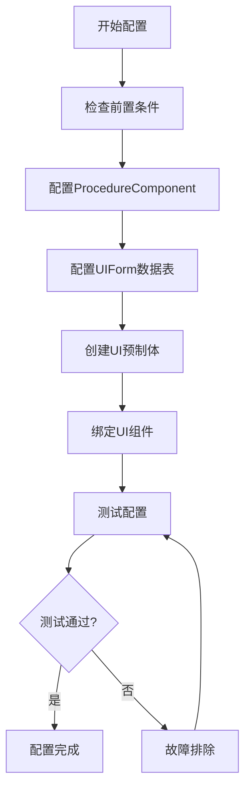

# Unity 编辑器配置指南 - 游戏结算流程

## 📋 文档概述

本文档将指导您在 Unity 编辑器中完成游戏结算流程的配置工作。所有代码实现已经完成，您只需要按照本指南完成编辑器中的配置即可让结算系统正常运行。

### 配置目标

- ✅ 将结算流程添加到游戏流程系统
- ✅ 配置结算界面的数据表信息
- ✅ 创建结算界面UI预制体
- ✅ 绑定UI组件到脚本
- ✅ 测试结算流程是否正常工作

### 配置流程图



---

## ✅ 前置条件检查

在开始配置之前，请确认以下条件：

### 1. 代码文件完整性

确认以下文件已存在且无编译错误：

- ✓ [`Assets/GameMain/Scripts/Definition/DataStruct/GameSettlementData.cs`](../Assets/GameMain/Scripts/Definition/DataStruct/GameSettlementData.cs)
- ✓ [`Assets/GameMain/Scripts/Procedure/ProcedureSettlement.cs`](../Assets/GameMain/Scripts/Procedure/ProcedureSettlement.cs)
- ✓ [`Assets/GameMain/Scripts/UI/SettlementForm.cs`](../Assets/GameMain/Scripts/UI/SettlementForm.cs)
- ✓ [`Assets/GameMain/Scripts/UI/UIFormId.cs`](../Assets/GameMain/Scripts/UI/UIFormId.cs) - 确认包含 `SettlementForm = 104`

### 2. Unity 环境要求

- **Unity 版本**：2017.3 或更高版本（推荐使用项目当前版本）
- **GameFramework**：已正确导入并配置
- **项目可正常编译**：无编译错误

### 3. 场景准备

- 确保场景中存在 `GameFramework` 预制体
- 确保 `ProcedureComponent` 组件已添加到场景中

---

## 🔧 配置步骤

### 步骤 1：配置 ProcedureComponent

#### 1.1 找到 ProcedureComponent

1. 在 Unity 编辑器中打开主场景（通常是 `StarForce Launcher.unity`）
2. 在 Hierarchy 窗口中找到 `GameFramework` 游戏对象
3. 在 Inspector 窗口中找到 `Procedure Component` 组件

#### 1.2 添加 ProcedureSettlement 到可用流程列表

1. 在 `Procedure Component` 中找到 `Available Procedures` 列表
2. 点击列表底部的 `+` 按钮增加一个新条目
3. 在新条目中选择 `StarForce.ProcedureSettlement`

**配置位置示意：**
```
GameFramework (GameObject)
└── Procedure Component
    └── Available Procedures
        ├── StarForce.ProcedureLaunch
        ├── StarForce.ProcedureSplash
        ├── StarForce.ProcedurePreload
        ├── StarForce.ProcedureMenu
        ├── StarForce.ProcedureChangeScene
        ├── StarForce.ProcedureMain
        └── StarForce.ProcedureSettlement  ← 添加这个
```

#### 1.3 注意事项

- ⚠️ 确保流程类名完整：`StarForce.ProcedureSettlement`
- ⚠️ 不要删除其他已有的流程
- ⚠️ 流程顺序不影响功能，但建议放在列表末尾

---

### 步骤 2：配置 UIForm 数据表

#### 2.1 打开 UIForm 数据表

1. 在 Project 窗口中导航到：`Assets/GameMain/DataTables/`
2. 找到并打开 `UIForm.txt` 文件（使用文本编辑器或 Excel）

#### 2.2 添加 SettlementForm 配置

在文件末尾添加以下配置行：

```
104	结算界面	SettlementForm	Default	FALSE	TRUE
```

**字段说明：**

| 字段 | 值 | 说明 |
|------|-----|------|
| Id | 104 | UI表单ID，对应 UIFormId.SettlementForm |
| 中文名 | 结算界面 | 界面的中文描述（可选） |
| AssetName | SettlementForm | 预制体文件名（不含.prefab扩展名） |
| UIGroupName | Default | UI组名称，使用默认组 |
| AllowMultiInstance | FALSE | 不允许多实例 |
| PauseCoveredUIForm | TRUE | 暂停被覆盖的UI |

#### 2.3 保存文件

- 保存 `UIForm.txt` 文件
- 返回 Unity 编辑器，等待自动重新导入

#### 2.4 验证配置

在 Unity 编辑器中：
1. 打开 `Window` → `Game Framework` → `Data Table`（如果有此工具）
2. 或者直接运行游戏，检查 Console 是否有数据表加载错误

---

### 步骤 3：创建 SettlementForm UI 预制体

#### 3.1 创建预制体目录（如果不存在）

1. 在 Project 窗口中导航到：`Assets/GameMain/UI/`
2. 如果不存在 `UIForms` 文件夹，右键创建：`Create` → `Folder`，命名为 `UIForms`

#### 3.2 创建 Canvas 根对象

1. 在 Hierarchy 窗口中右键：`UI` → `Canvas`
2. 重命名为 `SettlementForm`
3. 设置 Canvas 属性：
   - **Render Mode**: Screen Space - Overlay
   - **Canvas Scaler**: Scale With Screen Size
   - **Reference Resolution**: 1920 x 1080

#### 3.3 创建 UI 层级结构

在 `SettlementForm` Canvas 下创建以下层级：

```
SettlementForm (Canvas)
├── Background (Image)
│   └── Panel (Image)
│       ├── Title (Text)
│       ├── DataContainer (Empty GameObject)
│       │   ├── ScoreText (Text)
│       │   ├── KillCountText (Text)
│       │   ├── SurvivalTimeText (Text)
│       │   └── MaxComboText (Text)
│       └── BackToMenuButton (Button)
│           └── Text (Text)
```

#### 3.4 详细配置每个UI元素

##### Background（背景）
- **组件**: Image
- **Color**: 黑色，Alpha = 200（半透明）
- **Anchors**: Stretch（填满整个屏幕）

##### Panel（面板）
- **组件**: Image
- **Color**: 深灰色或自定义
- **RectTransform**: 
  - Width: 800
  - Height: 600
  - Anchors: Center
  - Position: (0, 0, 0)

##### Title（标题）
- **组件**: Text
- **Text**: "游戏结算"
- **Font Size**: 48
- **Alignment**: Center
- **Color**: 白色
- **Position**: 面板顶部，Y = 200

##### DataContainer（数据容器）
- **组件**: 空 GameObject（用于组织）
- **Position**: 面板中心

##### ScoreText（得分文本）
- **组件**: Text
- **Text**: "得分: 0"（占位符）
- **Font Size**: 32
- **Alignment**: Left
- **Position**: Y = 100

##### KillCountText（击杀数文本）
- **组件**: Text
- **Text**: "击杀: 0"（占位符）
- **Font Size**: 32
- **Alignment**: Left
- **Position**: Y = 50

##### SurvivalTimeText（存活时间文本）
- **组件**: Text
- **Text**: "存活时间: 0.0秒"（占位符）
- **Font Size**: 32
- **Alignment**: Left
- **Position**: Y = 0

##### MaxComboText（最大连击文本）
- **组件**: Text
- **Text**: "最大连击: 0"（占位符）
- **Font Size**: 32
- **Alignment**: Left
- **Position**: Y = -50

##### BackToMenuButton（返回按钮）
- **组件**: Button
- **RectTransform**: 
  - Width: 200
  - Height: 60
  - Position: Y = -200
- **Button Text**: "返回菜单"
- **Font Size**: 24

#### 3.5 添加 SettlementForm 脚本组件

1. 选中 `SettlementForm` Canvas 根对象
2. 在 Inspector 窗口点击 `Add Component`
3. 搜索并添加 `Settlement Form` 脚本
4. **不要现在绑定字段**，下一步会详细说明

#### 3.6 创建预制体

1. 将 Hierarchy 中的 `SettlementForm` 拖拽到 Project 窗口的 `Assets/GameMain/UI/UIForms/` 文件夹
2. 确认预制体文件名为 `SettlementForm.prefab`
3. 删除 Hierarchy 中的 `SettlementForm` 实例（预制体已保存）

---

### 步骤 4：绑定 UI 组件到脚本

#### 4.1 打开预制体编辑模式

1. 在 Project 窗口中双击 `SettlementForm.prefab`
2. 或者右键选择 `Open Prefab`

#### 4.2 选择根对象

在 Prefab 编辑模式下，选中 `SettlementForm` 根对象

#### 4.3 绑定序列化字段

在 Inspector 窗口中找到 `Settlement Form (Script)` 组件，依次绑定以下字段：

| 字段名 | 绑定目标 | 路径 |
|--------|----------|------|
| **M Score Text** | ScoreText | Panel/DataContainer/ScoreText |
| **M Kill Count Text** | KillCountText | Panel/DataContainer/KillCountText |
| **M Survival Time Text** | SurvivalTimeText | Panel/DataContainer/SurvivalTimeText |
| **M Max Combo Text** | MaxComboText | Panel/DataContainer/MaxComboText |
| **M Back To Menu Button** | BackToMenuButton | Panel/BackToMenuButton |

#### 4.4 绑定方法

**拖拽绑定：**
1. 在 Hierarchy（Prefab模式）中找到对应的UI对象
2. 拖拽到 Inspector 中对应的字段槽位
3. 确保字段显示正确的组件引用

**检查清单：**
- [ ] M Score Text 已绑定到 ScoreText (Text组件)
- [ ] M Kill Count Text 已绑定到 KillCountText (Text组件)
- [ ] M Survival Time Text 已绑定到 SurvivalTimeText (Text组件)
- [ ] M Max Combo Text 已绑定到 MaxComboText (Text组件)
- [ ] M Back To Menu Button 已绑定到 BackToMenuButton (Button组件)

#### 4.5 保存预制体

1. 点击 Prefab 编辑器顶部的 `Save` 按钮
2. 或使用快捷键 `Ctrl+S` (Windows) / `Cmd+S` (Mac)
3. 退出 Prefab 编辑模式

---

### 步骤 5：测试配置

#### 5.1 运行游戏

1. 在 Unity 编辑器中点击 `Play` 按钮
2. 开始一局游戏
3. 让玩家飞船被摧毁（触发游戏结束）

#### 5.2 测试检查点

按照以下清单验证功能：

**✓ 游戏启动检查**
- [ ] 游戏正常启动，无报错
- [ ] 主菜单正常显示
- [ ] 可以正常进入游戏

**✓ 游戏进行检查**
- [ ] 游戏玩法正常
- [ ] 可以击杀敌人
- [ ] 分数正常累计

**✓ 结算流程检查**
- [ ] 玩家死亡后，等待约2秒
- [ ] 自动进入结算界面
- [ ] 结算界面正常显示

**✓ 数据显示检查**
- [ ] 得分数据正确显示
- [ ] 击杀数量正确显示
- [ ] 存活时间正确显示（格式：X.X秒）
- [ ] 最大连击数正确显示

**✓ 交互检查**
- [ ] "返回菜单"按钮可见
- [ ] 点击按钮有响应
- [ ] 成功返回主菜单
- [ ] 可以再次开始游戏

#### 5.3 Console 日志检查

在测试过程中，观察 Console 窗口：
- ✅ 无红色错误信息
- ✅ 无黄色警告信息（或仅有无关警告）
- ℹ️ 可能看到正常的流程切换日志

---

## 🎨 可选配置

完成基础配置后，您可以根据需要进行以下美化和扩展：

### 美化结算界面

#### 添加背景图片
1. 准备一张背景图片（推荐尺寸：1920x1080）
2. 导入到 `Assets/GameMain/UI/Textures/` 目录
3. 将图片拖拽到 Background 的 Image 组件的 Source Image 字段

#### 添加动画效果
1. 创建 Animator Controller
2. 添加淡入动画：
   ```
   - 初始 Alpha = 0
   - 0.5秒内 Alpha → 1
   ```
3. 添加数字滚动效果（需要额外脚本）

#### 添加音效
1. 准备音效文件（.wav 格式）
2. 放置到 `Assets/GameMain/UI/UISounds/` 目录
3. 在 `SettlementForm.cs` 的 `OnOpen` 方法中添加：
   ```csharp
   GameEntry.Sound.PlayUISound(音效ID);
   ```

#### 自定义字体和颜色
1. 导入自定义字体到 `Assets/GameMain/Fonts/`
2. 在各个 Text 组件中设置字体
3. 调整颜色方案以匹配游戏风格

### 扩展功能

#### 添加更多统计数据

**修改 GameSettlementData.cs：**
```csharp
// 添加新字段
private readonly int m_TotalDamage;
private readonly int m_AccuracyRate;

// 添加对应的属性
public int TotalDamage => m_TotalDamage;
public int AccuracyRate => m_AccuracyRate;
```

**在 UI 中添加对应的 Text 组件并绑定**

#### 添加分享功能
1. 集成社交分享 SDK
2. 添加分享按钮
3. 实现截图和分享逻辑

#### 添加排行榜
1. 集成排行榜服务（如 PlayFab、LeanCloud）
2. 在结算界面显示排名
3. 添加查看完整排行榜按钮

#### 添加成就系统
1. 定义成就条件
2. 在结算时检查成就解锁
3. 显示新解锁的成就

---

## 🔍 故障排除

### 问题 1：结算界面不显示

**可能原因：**
- UIForm 数据表配置错误
- 预制体路径不正确
- 预制体未正确保存

**解决方案：**
1. 检查 `UIForm.txt` 中的配置：
   - ID 是否为 104
   - AssetName 是否为 "SettlementForm"
   - UIGroupName 是否为 "Default"
2. 确认预制体位置：`Assets/GameMain/UI/UIForms/SettlementForm.prefab`
3. 检查 Console 是否有资源加载错误
4. 尝试重新导入数据表：
   - 选中 `UIForm.txt`
   - 右键 → `Reimport`

### 问题 2：数据显示为 0 或错误

**可能原因：**
- 游戏数据未正确收集
- 数据传递失败
- UI 组件绑定错误

**解决方案：**
1. 检查 `GameBase.cs` 中的 `GetSettlementData()` 方法是否正确实现
2. 在 `ProcedureMain.cs` 中添加调试日志：
   ```csharp
   GameSettlementData data = m_CurrentGame.GetSettlementData();
   Log.Info($"Settlement Data: Score={data.Score}, Kills={data.KillCount}");
   ```
3. 确认 UI 组件绑定正确（步骤4）
4. 检查 `SettlementForm.cs` 中的数据显示逻辑

### 问题 3：按钮点击无反应

**可能原因：**
- Button 组件未正确绑定
- 事件监听未添加
- Canvas 的 Graphic Raycaster 缺失

**解决方案：**
1. 确认 `m_BackToMenuButton` 字段已正确绑定
2. 检查 Canvas 上是否有 `Graphic Raycaster` 组件
3. 确认 Button 组件的 `Interactable` 选项已勾选
4. 检查 `SettlementForm.cs` 的 `OnInit` 方法中是否正确添加了点击事件监听

### 问题 4：流程切换失败

**可能原因：**
- ProcedureSettlement 未添加到可用流程列表
- 流程切换逻辑错误
- FSM 数据传递失败

**解决方案：**
1. 确认步骤1中已正确添加 `StarForce.ProcedureSettlement`
2. 检查 `ProcedureMain.cs` 中的流程切换代码：
   ```csharp
   ChangeState<ProcedureSettlement>(procedureOwner);
   ```
3. 确认 `SettlementData` 已正确设置到 FSM：
   ```csharp
   procedureOwner.SetData<VarObject>("SettlementData", settlementData);
   ```
4. 查看 Console 中的流程切换日志

### 问题 5：编译错误

**可能原因：**
- 命名空间错误
- 类名拼写错误
- 缺少引用

**解决方案：**
1. 确认所有脚本文件的命名空间为 `StarForce`
2. 检查类名拼写是否正确
3. 确认所有必要的 using 语句已添加：
   ```csharp
   using UnityEngine;
   using UnityEngine.UI;
   using UnityGameFramework.Runtime;
   using GameFramework.Event;
   ```
4. 清理并重新编译：`Assets` → `Reimport All`

### 问题 6：预制体丢失引用

**可能原因：**
- 预制体编辑时未保存
- Unity 版本兼容性问题
- 预制体损坏

**解决方案：**
1. 重新打开预制体编辑模式
2. 重新绑定所有字段（步骤4）
3. 确保保存预制体
4. 如果问题持续，删除预制体重新创建

---

## 📚 参考资料

### 官方文档

- **GameFramework 官方文档**: https://gameframework.cn/
- **GameFramework GitHub**: https://github.com/EllanJiang/GameFramework
- **UnityGameFramework GitHub**: https://github.com/EllanJiang/UnityGameFramework

### StarForce 示例项目

- **StarForce 示例**: https://github.com/EllanJiang/StarForce
- 参考其他 UI 界面的实现方式
- 学习流程系统的使用方法

### 相关教程

- **GameFramework 入门教程**: 查看官方文档的快速入门部分
- **UI 系统教程**: 了解 GameFramework 的 UI 管理机制
- **流程系统教程**: 深入理解游戏流程的切换和管理

### 社区资源

- **GameFramework QQ群**: 查看官方网站获取最新群号
- **Unity 官方论坛**: https://forum.unity.com/
- **GameFramework 论坛**: 查看官方网站

---

## ✨ 配置完成检查清单

在完成所有配置后，请使用此清单进行最终确认：

### 代码层面
- [ ] 所有代码文件已创建且无编译错误
- [ ] UIFormId 枚举包含 SettlementForm = 104
- [ ] 命名空间统一为 StarForce

### 编辑器配置
- [ ] ProcedureComponent 包含 StarForce.ProcedureSettlement
- [ ] UIForm.txt 包含 SettlementForm 配置（ID=104）
- [ ] 预制体已创建：Assets/GameMain/UI/UIForms/SettlementForm.prefab

### UI 预制体
- [ ] Canvas 根对象存在
- [ ] 所有 UI 元素已创建（背景、面板、文本、按钮）
- [ ] SettlementForm 脚本已添加到根对象
- [ ] 所有序列化字段已正确绑定
- [ ] 预制体已保存

### 功能测试
- [ ] 游戏可以正常启动
- [ ] 玩家死亡后进入结算界面
- [ ] 结算数据正确显示
- [ ] 返回菜单按钮正常工作
- [ ] 可以重新开始游戏

### 可选项
- [ ] 已添加背景图片
- [ ] 已添加动画效果
- [ ] 已添加音效
- [ ] 已自定义字体和颜色

---

## 🎉 恭喜！

如果您已完成所有配置步骤并通过测试，那么游戏结算系统已经成功集成到您的项目中！

现在您可以：
- 继续美化结算界面
- 添加更多统计数据
- 实现扩展功能（排行榜、成就等）
- 优化用户体验

如果遇到任何问题，请参考故障排除部分，或查阅官方文档和社区资源。

---

**文档版本**: 1.0  
**最后更新**: 2025-12-22  
**适用项目**: StarForce (GameFramework)