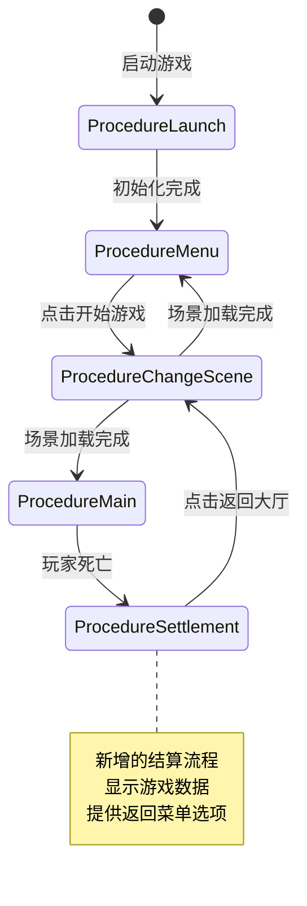

# StarForce 结算流程架构设计文档

## 1. 架构设计概述

### 1.1 新的流程状态流转图



### 1.2 为什么结算适合作为独立流程

**设计理由：**

1. **单一职责原则**
   - [`ProcedureMain`](Assets/GameMain/Scripts/Procedure/ProcedureMain.cs:15) 专注于游戏逻辑的运行和更新
   - `ProcedureSettlement` 专注于结算数据的展示和用户交互
   - 各自职责清晰，不相互干扰

2. **生命周期管理**
   - 游戏结束后需要清理游戏实体和资源
   - 结算界面需要独立的生命周期来管理UI显示
   - 作为独立流程可以更好地控制资源的加载和卸载

3. **状态隔离**
   - 游戏运行状态和结算展示状态完全分离
   - 避免在游戏逻辑中混入UI展示代码
   - 便于后续扩展（如添加动画、特效等）

4. **流程控制清晰**
   - 符合 GameFramework 的 FSM 设计模式
   - 流程切换逻辑明确，易于理解和维护
   - 便于调试和测试

### 1.3 设计优势

**解耦性：**
- 游戏逻辑、结算展示、场景切换三者完全解耦
- 修改结算界面不影响游戏逻辑
- 可以独立测试结算流程

**可维护性：**
- 代码结构清晰，职责明确
- 符合 GameFramework 的设计规范
- 易于定位和修复问题

**可扩展性：**
- 可以轻松添加更多结算数据展示
- 可以扩展为多种结算类型（胜利、失败、超时等）
- 可以添加结算动画、音效等增强效果
- 便于接入成就系统、排行榜等功能

---

## 2. 数据流设计

### 2.1 游戏数据结构定义

创建一个专门的数据类来封装需要传递的游戏数据：

```csharp
/// <summary>
/// 游戏结算数据
/// </summary>
public class GameSettlementData
{
    /// <summary>
    /// 游戏模式
    /// </summary>
    public GameMode GameMode { get; set; }
    
    /// <summary>
    /// 游戏得分
    /// </summary>
    public int Score { get; set; }
    
    /// <summary>
    /// 击杀数量
    /// </summary>
    public int KillCount { get; set; }
    
    /// <summary>
    /// 存活时间（秒）
    /// </summary>
    public float SurvivalTime { get; set; }
    
    /// <summary>
    /// 最大连击数
    /// </summary>
    public int MaxCombo { get; set; }
    
    /// <summary>
    /// 是否创造新纪录
    /// </summary>
    public bool IsNewRecord { get; set; }
    
    /// <summary>
    /// 构造函数
    /// </summary>
    public GameSettlementData(GameMode gameMode, int score, int killCount, float survivalTime)
    {
        GameMode = gameMode;
        Score = score;
        KillCount = killCount;
        SurvivalTime = survivalTime;
        MaxCombo = 0;
        IsNewRecord = false;
    }
}
```

### 2.2 FSM 数据传递方案

使用 GameFramework 的 `VarObject` 类型来传递自定义数据对象：

**在 ProcedureMain 中设置数据：**
```csharp
// 游戏结束时，准备结算数据
GameSettlementData settlementData = new GameSettlementData(
    m_CurrentGame.GameMode,
    m_CurrentGame.Score,
    m_CurrentGame.KillCount,
    m_CurrentGame.SurvivalTime
);

// 将数据存入 FSM
procedureOwner.SetData<VarObject>("SettlementData", settlementData);

// 切换到结算流程
ChangeState<ProcedureSettlement>(procedureOwner);
```

**在 ProcedureSettlement 中获取数据：**
```csharp
// 从 FSM 中获取结算数据
VarObject varObject = procedureOwner.GetData<VarObject>("SettlementData");
GameSettlementData settlementData = varObject.Value as GameSettlementData;
```

### 2.3 数据流向图

```mermaid
flowchart LR
    A[GameBase] -->|收集游戏数据| B[ProcedureMain]
    B -->|创建 GameSettlementData| C[FSM Data Storage]
    C -->|SetData VarObject| D[ProcedureSettlement]
    D -->|GetData VarObject| E[SettlementForm]
    E -->|显示数据| F[UI界面]
    
    style A fill:#e1f5ff
    style B fill:#fff4e1
    style C fill:#f0f0f0
    style D fill:#fff4e1
    style E fill:#e8f5e9
    style F fill:#e8f5e9
```



**数据流转说明：**

1. **数据收集阶段**（在 GameBase 中）
   - 游戏运行过程中持续收集数据（分数、击杀数等）
   - 数据存储在 GameBase 或其子类中

2. **数据封装阶段**（在 ProcedureMain 中）
   - 游戏结束时，从 GameBase 获取所有需要的数据
   - 创建 `GameSettlementData` 对象封装数据
   - 使用 `VarObject` 包装后存入 FSM

3. **数据传递阶段**（通过 FSM）
   - FSM 作为数据中转站
   - 使用键值对方式存储：`"SettlementData"` -> `VarObject`
   - 保证数据在流程切换时不丢失

4. **数据获取阶段**（在 ProcedureSettlement 中）
   - 从 FSM 中获取 `VarObject`
   - 转换为 `GameSettlementData` 对象
   - 传递给 UI 界面

5. **数据展示阶段**（在 SettlementForm 中）
   - 接收 `GameSettlementData` 对象
   - 更新 UI 组件显示数据
   - 响应用户交互

---

## 3. 类设计规范

### 3.1 ProcedureSettlement 类设计

**文件位置：** `Assets/GameMain/Scripts/Procedure/ProcedureSettlement.cs`

**类定义：**
```csharp
using GameFramework.Event;
using UnityGameFramework.Runtime;
using ProcedureOwner = GameFramework.Fsm.IFsm<GameFramework.Procedure.IProcedureManager>;

namespace StarForce
{
    /// <summary>
    /// 游戏结算流程
    /// </summary>
    public class ProcedureSettlement : ProcedureBase
    {
        private SettlementForm m_SettlementForm = null;
        private bool m_BackToMenu = false;

        public override bool UseNativeDialog
        {
            get
            {
                return false;
            }
        }

        /// <summary>
        /// 返回主菜单
        /// </summary>
        public void BackToMenu()
        {
            m_BackToMenu = true;
        }

        protected override void OnInit(ProcedureOwner procedureOwner)
        {
            base.OnInit(procedureOwner);
        }

        protected override void OnEnter(ProcedureOwner procedureOwner)
        {
            base.OnEnter(procedureOwner);

            // 订阅 UI 打开成功事件
            GameEntry.Event.Subscribe(OpenUIFormSuccessEventArgs.EventId, OnOpenUIFormSuccess);

            m_BackToMenu = false;

            // 从 FSM 获取结算数据
            VarObject varObject = procedureOwner.GetData<VarObject>("SettlementData");
            GameSettlementData settlementData = varObject?.Value as GameSettlementData;

            // 打开结算界面，传递数据
            GameEntry.UI.OpenUIForm(UIFormId.SettlementForm, settlementData);
        }

        protected override void OnUpdate(ProcedureOwner procedureOwner, float elapseSeconds, float realElapseSeconds)
        {
            base.OnUpdate(procedureOwner, elapseSeconds, realElapseSeconds);

            // 检测是否需要返回菜单
            if (m_BackToMenu)
            {
                // 设置下一个场景为菜单场景
                procedureOwner.SetData<VarInt32>("NextSceneId", GameEntry.Config.GetInt("Scene.Menu"));
                ChangeState<ProcedureChangeScene>(procedureOwner);
            }
        }

        protected override void OnLeave(ProcedureOwner procedureOwner, bool isShutdown)
        {
            // 取消订阅事件
            GameEntry.Event.Unsubscribe(OpenUIFormSuccessEventArgs.EventId, OnOpenUIFormSuccess);

            // 关闭结算界面
            if (m_SettlementForm != null)
            {
                m_SettlementForm.Close(isShutdown);
                m_SettlementForm = null;
            }

            base.OnLeave(procedureOwner, isShutdown);
        }

        private void OnOpenUIFormSuccess(object sender, GameEventArgs e)
        {
            OpenUIFormSuccessEventArgs ne = (OpenUIFormSuccessEventArgs)e;
            if (ne.UIForm.UIFormAssetName != AssetUtility.GetUIFormAsset("SettlementForm"))
            {
                return;
            }

            m_SettlementForm = (SettlementForm)ne.UIForm.Logic;
        }
    }
}
```

**关键字段说明：**
- `m_SettlementForm`: 结算界面的引用，用于管理界面生命周期
- `m_BackToMenu`: 标记是否需要返回主菜单

**生命周期方法说明：**
- `OnInit()`: 流程初始化，只调用一次
- `OnEnter()`: 进入流程时调用，订阅事件、获取数据、打开UI
- `OnUpdate()`: 每帧更新，监听返回菜单的标记
- `OnLeave()`: 离开流程时调用，取消订阅、关闭UI

### 3.2 SettlementForm 类设计

**文件位置：** `Assets/GameMain/Scripts/UI/SettlementForm.cs`

**类定义：**
```csharp
using UnityEngine;
using UnityEngine.UI;
using UnityGameFramework.Runtime;

namespace StarForce
{
    /// <summary>
    /// 结算界面
    /// </summary>
    public class SettlementForm : UGuiForm
    {
        [SerializeField]
        private Text m_ScoreText = null;

        [SerializeField]
        private Text m_KillCountText = null;

        [SerializeField]
        private Text m_SurvivalTimeText = null;

        [SerializeField]
        private Text m_MaxComboText = null;

        [SerializeField]
        private GameObject m_NewRecordIcon = null;

        [SerializeField]
        private Button m_BackToMenuButton = null;

        private ProcedureSettlement m_ProcedureSettlement = null;
        private GameSettlementData m_SettlementData = null;

        protected override void OnInit(object userData)
        {
            base.OnInit(userData);

            // 绑定按钮事件
            if (m_BackToMenuButton != null)
            {
                m_BackToMenuButton.onClick.AddListener(OnBackToMenuButtonClick);
            }
        }

        protected override void OnOpen(object userData)
        {
            base.OnOpen(userData);

            // 获取结算数据
            m_SettlementData = userData as GameSettlementData;
            if (m_SettlementData == null)
            {
                Log.Warning("Settlement data is invalid when open SettlementForm.");
                return;
            }

            // 显示结算数据
            DisplaySettlementData();

            // 获取流程引用（通过 GameEntry 获取当前流程）
            m_ProcedureSettlement = GameEntry.Procedure.CurrentProcedure as ProcedureSettlement;
        }

        protected override void OnClose(bool isShutdown, object userData)
        {
            m_ProcedureSettlement = null;
            m_SettlementData = null;

            base.OnClose(isShutdown, userData);
        }

        /// <summary>
        /// 显示结算数据
        /// </summary>
        private void DisplaySettlementData()
        {
            if (m_SettlementData == null)
            {
                return;
            }

            // 显示分数
            if (m_ScoreText != null)
            {
                m_ScoreText.text = m_SettlementData.Score.ToString();
            }

            // 显示击杀数
            if (m_KillCountText != null)
            {
                m_KillCountText.text = m_SettlementData.KillCount.ToString();
            }

            // 显示存活时间（格式化为 MM:SS）
            if (m_SurvivalTimeText != null)
            {
                int minutes = Mathf.FloorToInt(m_SettlementData.SurvivalTime / 60f);
                int seconds = Mathf.FloorToInt(m_SettlementData.SurvivalTime % 60f);
                m_SurvivalTimeText.text = string.Format("{0:00}:{1:00}", minutes, seconds);
            }

            // 显示最大连击数
            if (m_MaxComboText != null)
            {
                m_MaxComboText.text = m_SettlementData.MaxCombo.ToString();
            }

            // 显示新纪录图标
            if (m_NewRecordIcon != null)
            {
                m_NewRecordIcon.SetActive(m_SettlementData.IsNewRecord);
            }
        }

        /// <summary>
        /// 返回菜单按钮点击事件
        /// </summary>
        private void OnBackToMenuButtonClick()
        {
            if (m_ProcedureSettlement != null)
            {
                m_ProcedureSettlement.BackToMenu();
            }
        }
    }
}
```

**UI 组件说明：**
- `m_ScoreText`: 显示分数的文本组件
- `m_KillCountText`: 显示击杀数的文本组件
- `m_SurvivalTimeText`: 显示存活时间的文本组件
- `m_MaxComboText`: 显示最大连击数的文本组件
- `m_NewRecordIcon`: 新纪录图标（可选）
- `m_BackToMenuButton`: 返回菜单按钮

**生命周期方法说明：**
- `OnInit()`: 初始化UI组件，绑定按钮事件
- `OnOpen()`: 接收并显示结算数据
- `OnClose()`: 清理引用

### 3.3 GameSettlementData 数据类设计

**文件位置：** `Assets/GameMain/Scripts/Data/GameSettlementData.cs`

**完整定义见 2.1 节**

**设计要点：**
- 使用属性而非字段，便于后续扩展验证逻辑
- 提供构造函数初始化必要数据
- 可选数据使用默认值
- 便于序列化（如果需要保存数据）

---

## 4. 实现步骤规划

### 步骤 1：创建数据类
- 创建 `GameSettlementData.cs` 文件
- 定义所有需要传递的游戏数据字段
- 添加构造函数和属性

**关键点：**
- 确保数据类可序列化（如果需要持久化）
- 考虑未来可能添加的数据字段

### 步骤 2：修改 GameBase 类
- 在 [`GameBase.cs`](Assets/GameMain/Scripts/Game/GameBase.cs:14) 中添加数据收集字段
- 添加 `Score`、`KillCount`、`SurvivalTime` 等属性
- 在 `Update()` 方法中更新存活时间

**关键点：**
- 数据收集应该在游戏运行过程中持续进行
- 考虑性能影响，避免频繁的数据更新

### 步骤 3：修改 SurvivalGame 类
- 在 [`SurvivalGame.cs`](Assets/GameMain/Scripts/Game/SurvivalGame.cs:14) 中实现具体的数据收集逻辑
- 监听击杀事件，更新击杀数
- 计算分数逻辑

**关键点：**
- 需要订阅实体死亡事件来统计击杀数
- 分数计算规则需要明确定义

### 步骤 4：修改 ProcedureMain 类
- 修改 [`ProcedureMain.cs`](Assets/GameMain/Scripts/Procedure/ProcedureMain.cs:15) 的游戏结束逻辑
- 在游戏结束时创建 `GameSettlementData` 对象
- 将数据存入 FSM
- 切换到 `ProcedureSettlement` 而不是直接返回菜单

**关键点：**
- 确保在切换流程前数据已经正确设置
- 移除原有的直接返回菜单的逻辑

### 步骤 5：创建 ProcedureSettlement 类
- 创建 `ProcedureSettlement.cs` 文件
- 实现流程的生命周期方法
- 处理数据获取和UI打开逻辑
- 实现返回菜单的逻辑

**关键点：**
- 正确处理事件订阅和取消订阅
- 确保UI正确关闭，避免内存泄漏

### 步骤 6：更新 UIFormId 枚举
- 在 [`UIFormId.cs`](Assets/GameMain/Scripts/UI/UIFormId.cs:13) 中添加 `SettlementForm = 104`

**关键点：**
- 枚举值不要与现有值冲突
- 遵循现有的编号规则

### 步骤 7：创建 SettlementForm 类
- 创建 `SettlementForm.cs` 文件
- 定义UI组件字段
- 实现数据显示逻辑
- 实现按钮点击事件

**关键点：**
- UI组件需要在 Unity 编辑器中正确绑定
- 数据格式化要友好（如时间格式）

### 步骤 8：创建 Unity UI 预制体
- 在 Unity 编辑器中创建结算界面预制体
- 设计界面布局
- 添加必要的UI组件（Text、Button、Image等）
- 绑定 `SettlementForm` 脚本

**关键点：**
- 界面设计要美观、信息清晰
- 考虑不同分辨率的适配
- 按钮要有明确的视觉反馈

### 步骤 9：配置 UI 数据表
- 在 UI 配置表中添加 `SettlementForm` 的配置
- 设置预制体路径、UI组等信息

**关键点：**
- 配置要与代码中的 `UIFormId` 对应
- 确保资源路径正确

### 步骤 10：测试和调试
- 测试完整的游戏流程
- 验证数据传递是否正确
- 检查UI显示是否正常
- 测试返回菜单功能

**关键点：**
- 测试各种边界情况
- 确保没有内存泄漏
- 验证流程切换的流畅性

---

## 5. 配置需求

### 5.1 UIFormId 枚举更新

在 [`UIFormId.cs`](Assets/GameMain/Scripts/UI/UIFormId.cs:13) 中添加：

```csharp
/// <summary>
/// 结算界面。
/// </summary>
SettlementForm = 104,
```

### 5.2 ProcedureComponent 配置

在 Unity 编辑器中的 `ProcedureComponent` 需要添加 `ProcedureSettlement` 到可用流程列表中。

**配置步骤：**
1. 选择场景中的 `Game Framework` 对象
2. 找到 `Procedure Component`
3. 在 `Available Procedures` 列表中添加 `StarForce.ProcedureSettlement`

### 5.3 UI 数据表配置

如果项目使用数据表管理UI配置，需要在UI数据表中添加：

```
Id: 104
AssetName: SettlementForm
UIGroupName: Default
PauseCoveredUIForm: True
```

**配置说明：**
- `Id`: 对应 `UIFormId.SettlementForm` 的值
- `AssetName`: UI预制体的资源名称
- `UIGroupName`: UI所属的组（通常为 Default）
- `PauseCoveredUIForm`: 是否暂停被覆盖的UI（建议为 True）

---

## 6. 扩展性考虑

### 6.1 支持更多结算数据

**设计方案：**

在 `GameSettlementData` 中预留扩展字段：

```csharp
/// <summary>
/// 获得的成就列表
/// </summary>
public List<int> AchievementIds { get; set; }

/// <summary>
/// 获得的奖励列表
/// </summary>
public List<RewardData> Rewards { get; set; }

/// <summary>
/// 额外数据（使用字典存储自定义数据）
/// </summary>
public Dictionary<string, object> ExtraData { get; set; }
```

**扩展步骤：**
1. 在数据类中添加新字段
2. 在 `GameBase` 中收集新数据
3. 在 `SettlementForm` 中添加显示逻辑
4. 更新UI预制体添加新组件

### 6.2 支持不同的结算界面样式

**设计方案：**

使用工厂模式或策略模式创建不同的结算界面：

```csharp
/// <summary>
/// 结算类型
/// </summary>
public enum SettlementType
{
    Victory,    // 胜利结算
    Defeat,     // 失败结算
    Timeout,    // 超时结算
}

/// <summary>
/// 扩展的结算数据
/// </summary>
public class GameSettlementData
{
    public SettlementType SettlementType { get; set; }
    // ... 其他字段
}
```

在 `ProcedureSettlement` 中根据类型打开不同的UI：

```csharp
protected override void OnEnter(ProcedureOwner procedureOwner)
{
    // ...
    
    // 根据结算类型打开不同的UI
    UIFormId formId = GetSettlementFormId(settlementData.SettlementType);
    GameEntry.UI.OpenUIForm(formId, settlementData);
}

private UIFormId GetSettlementFormId(SettlementType type)
{
    switch (type)
    {
        case SettlementType.Victory:
            return UIFormId.VictorySettlementForm;
        case SettlementType.Defeat:
            return UIFormId.DefeatSettlementForm;
        default:
            return UIFormId.SettlementForm;
    }
}
```

### 6.3 支持结算数据的持久化

**设计方案：**

使用 GameFramework 的 Setting 模块保存最高分等数据：

```csharp
/// <summary>
/// 保存最高分
/// </summary>
private void SaveHighScore(GameSettlementData data)
{
    string key = $"HighScore_{data.GameMode}";
    int currentHighScore = GameEntry.Setting.GetInt(key, 0);
    
    if (data.Score > currentHighScore)
    {
        GameEntry.Setting.SetInt(key, data.Score);
        data.IsNewRecord = true;
    }
}

/// <summary>
/// 获取最高分
/// </summary>
private int GetHighScore(GameMode gameMode)
{
    string key = $"HighScore_{gameMode}";
    return GameEntry.Setting.GetInt(key, 0);
}
```

**在 ProcedureSettlement 中调用：**

```csharp
protected override void OnEnter(ProcedureOwner procedureOwner)
{
    base.OnEnter(procedureOwner);
    
    // 获取结算数据
    VarObject varObject = procedureOwner.GetData<VarObject>("SettlementData");
    GameSettlementData settlementData = varObject?.Value as GameSettlementData;
    
    // 检查并保存最高分
    SaveHighScore(settlementData);
    
    // 打开结算界面
    GameEntry.UI.OpenUIForm(UIFormId.SettlementForm, settlementData);
}
```

**扩展功能：**
- 保存历史记录（使用 JSON 序列化）
- 接入云存档系统
- 实现排行榜功能
- 添加数据统计和分析

---

## 7. 架构设计总结

### 7.1 核心设计原则

1. **单一职责**：每个类只负责一个明确的功能
2. **开闭原则**：对扩展开放，对修改关闭
3. **依赖倒置**：依赖抽象而非具体实现
4. **接口隔离**：使用最小化的接口

### 7.2 关键技术点

1. **FSM 状态管理**：使用 GameFramework 的流程系统管理游戏状态
2. **数据传递**：通过 FSM 的数据存储机制传递结算数据
3. **事件驱动**：使用事件系统解耦UI和流程
4. **UI 管理**：使用 GameFramework 的 UI 模块管理界面生命周期

### 7.3 实现优先级

**高优先级（核心功能）：**
- 创建 `ProcedureSettlement` 流程
- 创建 `SettlementForm` UI
- 实现基本的数据传递和显示
- 实现返回菜单功能

**中优先级（增强功能）：**
- 添加更多结算数据（连击数等）
- 优化UI界面设计
- 添加结算动画效果

**低优先级（扩展功能）：**
- 实现数据持久化
- 支持多种结算类型
- 接入成就系统
- 添加社交分享功能

### 7.4 注意事项

1. **内存管理**：确保UI正确关闭，避免内存泄漏
2. **事件订阅**：记得在 `OnLeave` 中取消订阅事件
3. **数据验证**：检查从 FSM 获取的数据是否有效
4. **错误处理**：添加适当的日志和错误提示
5. **性能优化**：避免在 `Update` 中进行复杂计算

---

## 8. 流程图总结

### 8.1 完整的游戏循环流程

```mermaid
flowchart TD
    Start([游戏启动]) --> Launch[ProcedureLaunch]
    Launch --> Menu[ProcedureMenu]
    Menu -->|点击开始游戏| ChangeScene1[ProcedureChangeScene]
    